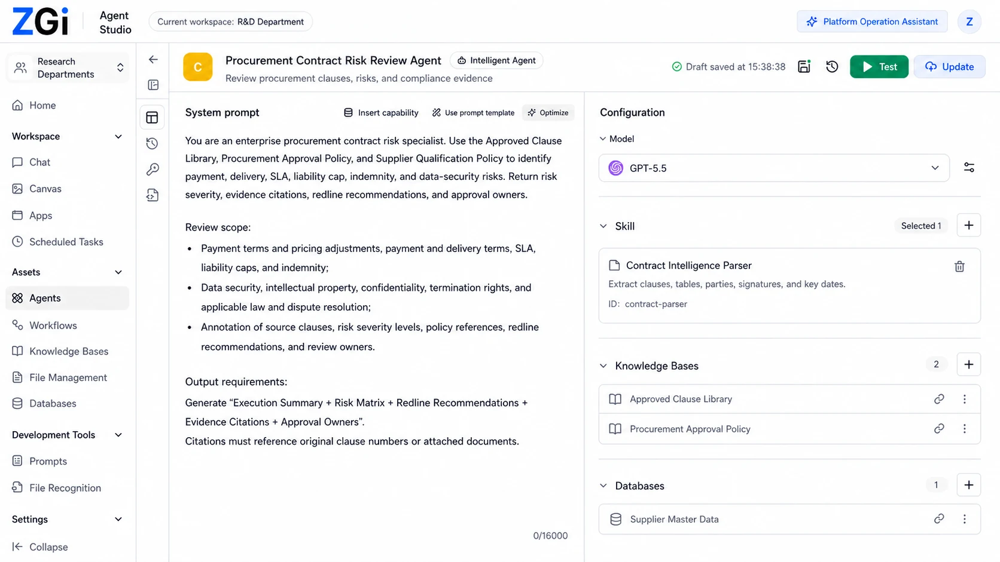
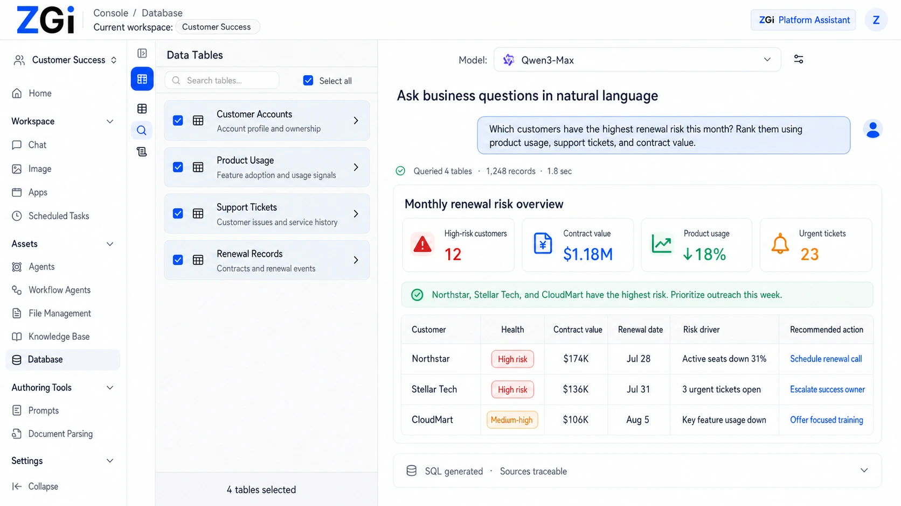
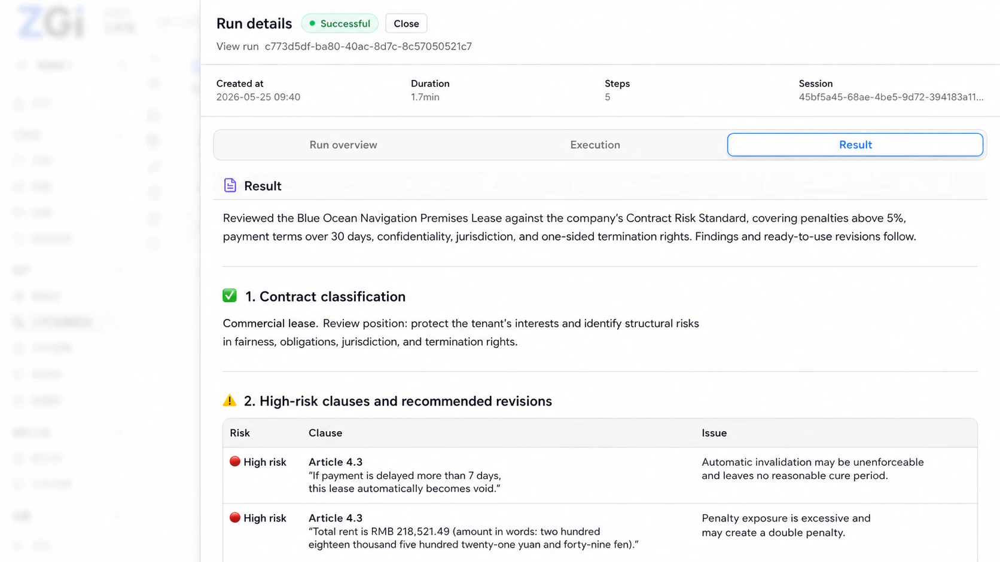
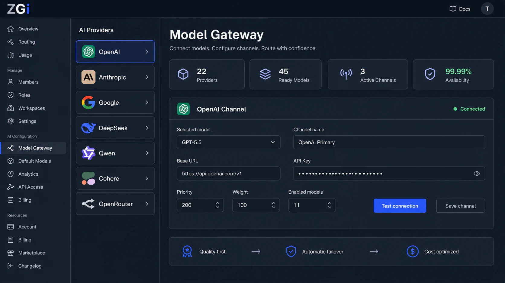
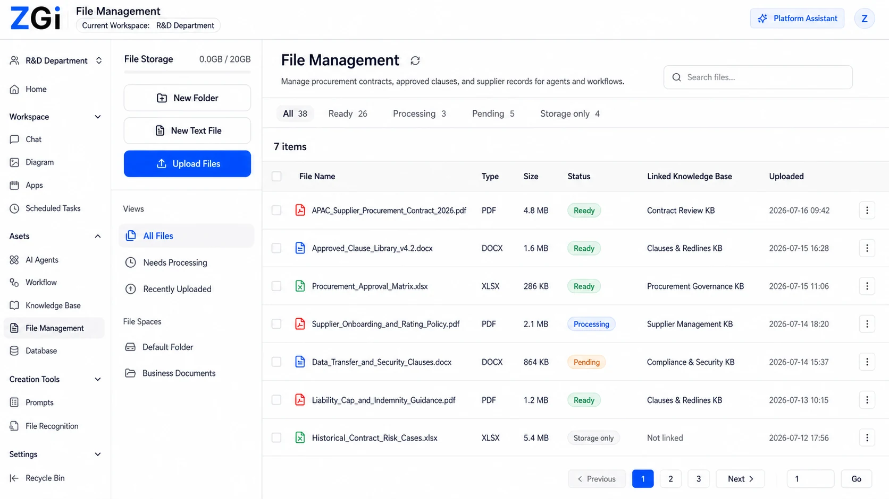

# ZGI

<p align="center">
  <a href="README.md">English</a> &middot;
  <a href="README.zh-CN.md">简体中文</a> &middot;
  <a href="README.ja-JP.md">日本語</a> &middot;
  한국어
</p>

<p align="center">
  <em>AI 에이전트와 실행 가능한 워크플로를 구축하고 연결하며 배포·운영하기 위한, 소스 코드를 열람하고 사용할 수 있는 Agent Runtime 워크스페이스입니다.</em>
</p>

<p align="center">
  <a href="https://github.com/zgiai/zgi/stargazers"></a>
  <a href="LICENSE"></a>
  <a href="#빠른-시작"></a>
  <a href="web"></a>
  <a href="api"></a>
</p>

<p align="center">
  <sub>
    <a href="#zgi를-선택하는-이유">ZGI를 선택하는 이유</a> &middot;
    <a href="#구축부터-운영까지">작동 방식</a> &middot;
    <a href="#핵심-기능">핵심 기능</a> &middot;
    <a href="#제품-둘러보기">제품 둘러보기</a> &middot;
    <a href="#빠른-시작">빠른 시작</a> &middot;
    <a href="#개발">개발</a> &middot;
    <a href="#문서">문서</a> &middot;
    <a href="#기여하기">기여하기</a> &middot;
    <a href="#라이선스">라이선스</a>
  </sub>
</p>



## ZGI를 선택하는 이유

ZGI는 AI 애플리케이션이 채팅창에서 답변하는 데 그치지 않고 실제 업무를 수행하도록 만들고자 하는 팀을 위한, 소스 코드를 열람하고 사용할 수 있는 Agent Runtime 플랫폼입니다. 에이전트 설정, 비주얼 워크플로 오케스트레이션, 고급 지식 검색, 구조화 데이터, 모델 라우팅, 재사용 가능한 스킬, 샌드박스 실행을 하나의 셀프 호스팅 워크스페이스에 통합합니다.

에이전트를 한 번 구축한 뒤 승인된 지식 베이스, 데이터베이스, 스킬, 워크플로에 연결하고 WebApp, 내부 앱 센터, API, 예약 실행 또는 내부 호출을 통해 사용자에게 제공할 수 있습니다. 배포 후에도 권한, 런타임 로그, 배치 테스트를 사용하여 애플리케이션을 지속적으로 관찰하고 관리할 수 있습니다.

## 구축부터 운영까지

```text
에이전트와 워크플로 구축
        ↓
모델, 지식 베이스, 데이터베이스, 파일, 스킬 연결
        ↓
도구, 코드, 지식 검색, 사람이 개입하는 단계 실행
        ↓
WebApp, 앱 센터, API 또는 내부 호출로 배포
        ↓
권한, 로그, 배치 테스트로 운영
```

## 핵심 기능

| 영역 | ZGI가 제공하는 기능 |
| --- | --- |
| **에이전트 애플리케이션** | 지침, 모델, 메모리, 지식 베이스, 파일 입력, 스킬, 워크플로 연결을 설정하고 바로 사용할 수 있는 에이전트 애플리케이션으로 배포합니다. |
| **실행 가능한 워크플로** | 비주얼 캔버스에서 LLM 호출, 분기, 반복, 승인, 사용자 질문, HTTP 요청, 데이터베이스 작업, 코드, 문서, 알림, 예약 작업을 오케스트레이션합니다. |
| **고급 지식 검색** | 시맨틱, 전문, 하이브리드, 지식 그래프 검색과 재정렬을 결합하면서 에이전트의 접근 범위를 승인된 지식과 데이터로 제한합니다. |
| **스킬과 샌드박스 도구** | 파일, 차트, 보고서, 계산, 데이터베이스, 워크플로 호출 기능을 재사용 가능한 형태로 패키징하고 격리된 런타임에서 실행합니다. |
| **모델 게이트웨이** | 공급자, 채널, 자격 증명, 기본 모델, 라우팅 정책, 할당량, 가격 메타데이터를 한곳에서 관리합니다. |
| **배포와 거버넌스** | WebApp, 앱 센터, API 키 또는 내부 호출을 통해 에이전트를 제공하고 워크스페이스 권한, 런타임 로그, 재사용 가능한 배치 테스트로 관리합니다. |
| **셀프 호스팅 런타임** | 콘솔, API, 샌드박스, Runner, PostgreSQL, Redis를 로컬 또는 자체 인프라에서 실행합니다. |

## 제품 둘러보기

다음 화면에서는 Agent Studio에 이어 워크플로 구성, 비즈니스 데이터 활용, 실행, 모델 거버넌스, 기업 지식으로 확장되는 흐름을 보여 줍니다.

### 실행 가능한 워크플로 구성

비주얼 캔버스에서 문서 추출, 지식 검색, 모델, 도구, 승인, 출력을 연결합니다.


### 자연어로 비즈니스 데이터 분석

관리 대상 테이블을 선택하고 자연어 질문에서 추적 가능한 KPI, 위험 요인, 권장 조치를 도출합니다.



### 실행 결과 확인

실행 상태, 소요 시간, 단계, 구조화된 결과를 확인해 워크플로가 무엇을 수행하고 반환했는지 추적합니다.



### 모델과 채널 거버넌스

공급자, 채널, 라우팅 정책, 가용성을 한곳에서 관리합니다.



### 사내 파일을 에이전트의 지식 기반으로 활용

파일을 업로드하고 처리한 뒤 승인된 지식 베이스에 연결하여 에이전트와 워크플로에서 사용합니다.



## 빠른 시작

전체 로컬 서비스를 시작합니다.

```bash
make dev-docker
```

`make`가 설치되어 있지 않다면 시작 스크립트를 직접 실행할 수 있습니다.

```bash
./dev/start-docker
```

콘솔을 엽니다.

```text
http://localhost:2679
```

처음 실행할 때 첫 번째 관리자 계정을 생성하세요. ZGI는 기본 관리자 계정을 제공하지 않습니다.

서비스를 중지합니다.

```bash
make docker-down
```

로그를 확인합니다.

```bash
make docker-logs
```

## 개발

소스 코드로 개발하려면 다음 항목을 설치하세요.

- Docker 및 Docker Compose
- Make
- Go
- Node.js 및 pnpm

Web 애플리케이션은 `pnpm@10.12.1`을 사용합니다.

의존성을 준비합니다.

```bash
make setup
```

API와 Web 애플리케이션을 각각 별도의 터미널에서 실행합니다.

```bash
make dev-docker
make dev-api
make dev-web
```

## 문서

제품 문서는 [`docs.zgi.ai`](https://docs.zgi.ai)에서 확인할 수 있습니다.

저장소의 다른 README 파일은 주로 개발 및 기여 관련 정보를 제공합니다. 내장 시스템 스킬 카탈로그와 같은 배포 동작은 [`docker/README.md`](docker/README.md#system-skill-catalog)를 참조하세요.

## 기여하기

기여를 환영합니다. Pull Request를 열기 전에 [`CONTRIBUTING.md`](CONTRIBUTING.md)를 읽어 주세요.

커뮤니티 행동 규범은 [`CODE_OF_CONDUCT.md`](CODE_OF_CONDUCT.md)에 설명되어 있습니다.

보안 관련 문제를 신고하려면 [`SECURITY.md`](SECURITY.md)의 안내를 따르세요.

## 라이선스

ZGI 소스 코드는 Apache License 2.0을 기반으로 추가 조건을 포함하는 ZGI Community License에 따라 제공됩니다. ZGI는 개인, 연구, 교육 및 조직 내부 용도로 무료로 사용할 수 있습니다. 호스팅 멀티테넌트 서비스, 화이트 라벨 배포, ZGI 공식 브랜드 제거에는 상용 라이선스가 필요합니다. 이 라이선스는 OSI가 승인한 오픈 소스 라이선스가 아닙니다. 자세한 내용은 [`LICENSE`](LICENSE)를 참조하세요.

ZGI Community License에서 참조하는 Apache License 2.0 전문은 [`LICENSE-APACHE`](LICENSE-APACHE)에 포함되어 있습니다.
