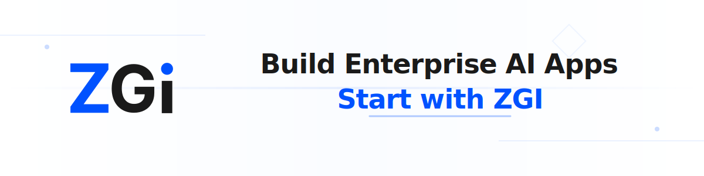

<p align="center">
  <a href="https://zgi.ai">
    
  </a>
</p>

<p align="center">
  <a href="https://zgi.ai">ZGI Cloud</a> ·
  <a href="https://docs.zgi.ai">Documentation</a> ·
  <a href="https://zgi.ai/pricing">Pricing</a>
</p>

<p align="center">
    <a href="https://zgi.ai" target="_blank">
        </a>
    <a href="https://discord.gg/zgi" target="_blank">
        </a>
    <a href="https://twitter.com/intent/follow?screen_name=zgi_ai" target="_blank">
        </a>
    <a href="https://github.com/zgiai/zgi/graphs/commit-activity" target="_blank">
        </a>
    <a href="https://github.com/zgiai/zgi/" target="_blank">
        </a>
    <a href="https://github.com/zgiai/zgi/stargazers" target="_blank">
        </a>
</p>

<p align="center">
  <a href="./README.md"></a>
  <a href="./README_CN.md"></a>
  <a href="./README_JA.md"></a>
</p>

ZGI is an open-source platform for building AI applications. Its intuitive interface combines workflow design, agent orchestration, dataset management, and model integration—allowing you to quickly move from prototype to production.

## Quick start

```bash
git clone --recursive https://github.com/zgiai/zgi.git
cd zgi/docker
cp .env.example .env
docker compose up -d
```

After running, access the dashboard at [http://localhost:3000](http://localhost:3000).

For detailed setup instructions, see our [documentation](https://docs.zgi.ai).

## Key features

**1. Workflow Designer**:
Build and test AI workflows on a visual canvas with drag-and-drop interface, real-time preview, and version control.

**2. LLM Gateway**:
Unified gateway for managing multiple LLM providers with intelligent routing, load balancing, weighted distribution, token usage tracking, and detailed cost analytics across all channels.

**3. Comprehensive model support**:
Seamless integration with hundreds of proprietary / open-source LLMs from dozens of inference providers and self-hosted solutions, covering GPT, Claude, Llama, and any OpenAI API-compatible models.

**4. Agent System**:
Create and manage AI agents with tool integration, memory management, and multi-agent collaboration support.

**5. Dataset Management**:
Extensive capabilities for document ingestion and processing, with out-of-box support for text extraction from PDFs, DOCX, XLS, and other common document formats.

**6. Plugin Ecosystem**:
Extend functionality through plugins. Build custom plugins or use community-contributed ones with our SDK.

**7. Analytics & Monitoring**:
Monitor and analyze application usage, performance metrics, and costs over time. Track API calls, tokens, and user interactions.

**8. Backend-as-a-Service**:
All of ZGI's offerings come with corresponding APIs, so you could effortlessly integrate ZGI into your own business logic.

## Using ZGI

- **Cloud**  
  We host a [ZGI Cloud](https://zgi.ai) service for anyone to try with zero setup.

- **Self-hosting ZGI Community Edition**  
  Quickly get ZGI running in your environment with this [starter guide](#quick-start).
  Use our [documentation](https://docs.zgi.ai) for further references and more in-depth instructions.
  Clone from [GitHub](https://github.com/zgiai/zgi).

- **ZGI for enterprise / organizations**  
  We provide additional enterprise-centric features. [Send us an email](mailto:business@zgi.ai?subject=%5BGitHub%5DBusiness%20License%20Inquiry) to discuss enterprise needs.

## Deployment

ZGI supports multiple deployment options including Kubernetes, Terraform, and cloud platforms.

For detailed deployment guides, see our [documentation](https://docs.zgi.ai/deployment).

## Contributing

See our [Contribution Guide](CONTRIBUTING.md) for code contributions.

## Community

- [GitHub Discussion](https://github.com/zgiai/zgi/discussions) - Feedback and questions
- [GitHub Issues](https://github.com/zgiai/zgi/issues) - Bug reports and feature requests
- [Discord](https://discord.gg/zgi) - Community chat
- [X(Twitter)](https://twitter.com/zgi_ai) - Updates and news

## Star History

[](https://star-history.com/#zgiai/zgi&Date)

## Stay Up-to-date

Star and watch our repository to stay updated with the latest features and improvements!

<p align="center">
  <a href="https://github.com/zgiai/zgi">
    
  </a>
</p>

## Security

Report security issues to security@zgi.ai instead of GitHub.

## License

This repository is licensed under the [ZGI Open Source License](LICENSE), which is free for personal, educational, and internal development use. Commercial use requires a commercial license.

For commercial licensing inquiries, please contact: business@zgi.ai
