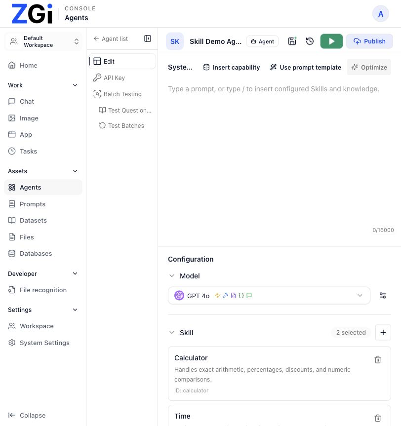
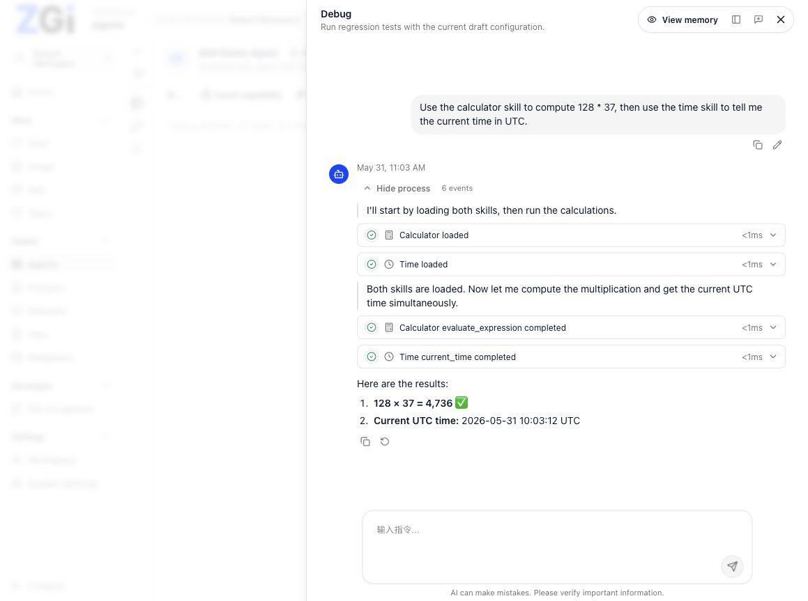
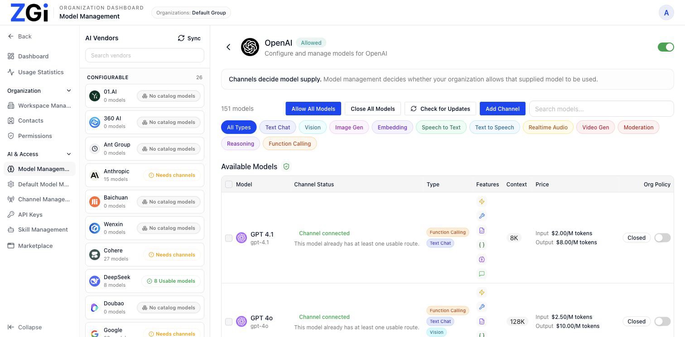
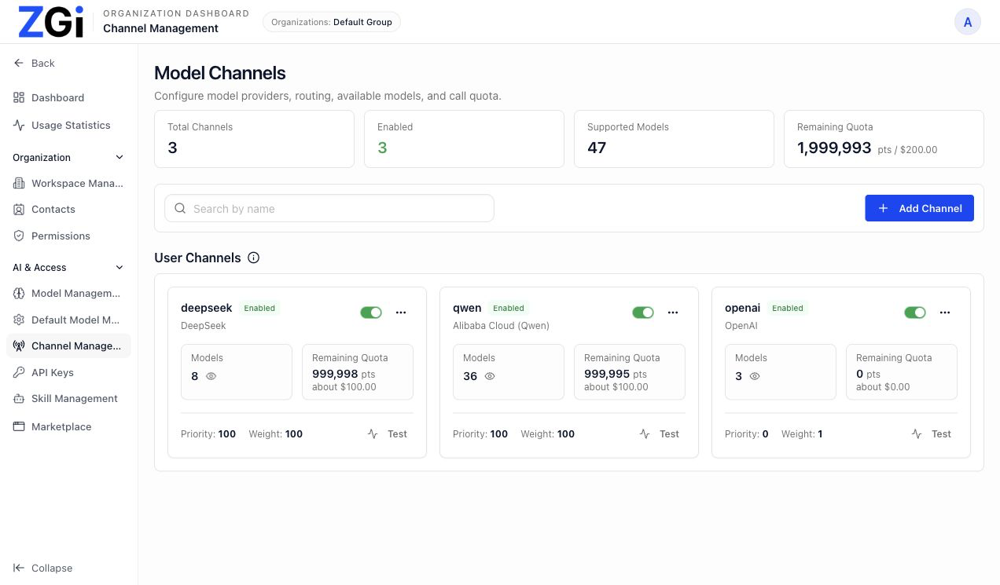
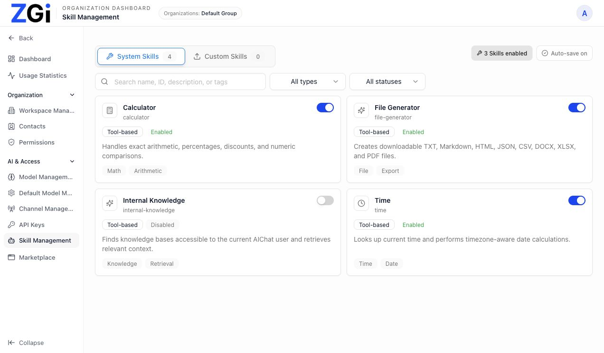
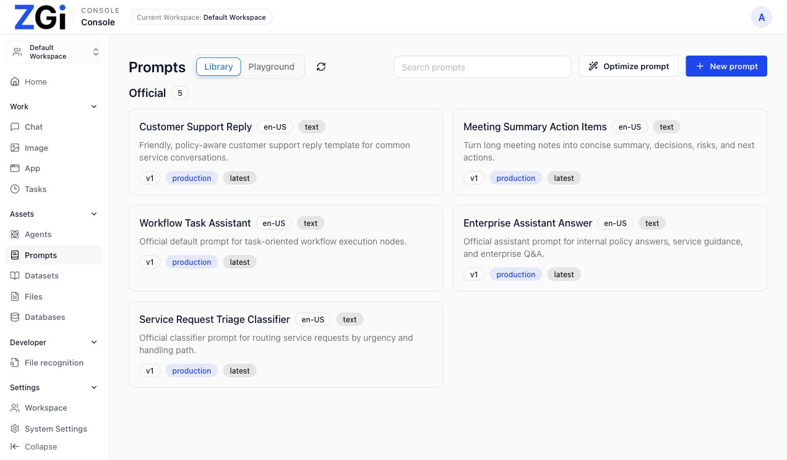

# ZGI

ZGI is a source-available AI application platform for building, running, and
operating agents, workflows, skills, prompts, knowledge, and model routes from
one workspace.

The project brings a Go backend, a Next.js console, a sandbox service, and a
plugin runner into one monorepo so teams can inspect the full stack, run it
locally, and extend it for their own AI application infrastructure.

Repository: https://github.com/zgiai/zgi


## Why ZGI

ZGI is designed for teams that want more than a chat UI. It gives you a control
plane for model access, a visual runtime for multi-step applications, and a
skill system for connecting agents to real tools.

- Build visual workflows with HTTP requests, JSON parsing, LLM steps, branching,
  and typed input/output nodes.
- Configure agents with model settings, instructions, knowledge, and callable
  skills.
- Route traffic across model providers and channels while keeping provider
  credentials and model defaults centrally managed.
- Debug agent runs with streamed events, skill loading, tool calls, and final
  outputs in one trace.
- Manage reusable prompts, file recognition flows, datasets, and workspace
  applications from the web console.
- Run the product locally with Docker, or develop each service from source.

## Screenshots

<p>
  
  
</p>

<p>
  
  
</p>

<p>
  
  
</p>

## Core Capabilities

### Agent and Skill Runtime

Create agents with instructions, model configuration, knowledge, and selected
skills. The debug console shows the runtime path clearly: skill loading, tool
invocation, tool results, and final model output.

### Visual Workflow Builder

Compose AI application flows as a graph. Workflows can combine request nodes,
parsing nodes, LLM nodes, input/output mapping, and reusable templates for
common automation patterns.

### Model Gateway and Routing

Centralize model providers, credentials, model defaults, channel selection,
pricing metadata, and usage controls. The console separates provider capability
management from application-level model selection.

### Workspace Console

Operate applications, prompts, skills, datasets, files, API keys, and content
parsing from the same web workspace. The console is built for repeatable
operations rather than one-off demos.

### Runtime Services

ZGI includes optional services for isolated code execution and plugin execution.
You can run only the core stack for product exploration, or start the fuller
runtime when testing skills, sandbox workloads, and knowledge features.

## Repository Layout

```text
.
├── api/             Go backend service
├── web/             Next.js web console
├── sandbox/         Isolated execution service
├── runner/          Plugin execution service
├── docker/          Product-level Docker Compose assets
├── dev/             Local development scripts
├── scripts/         Maintenance scripts
├── docs/            Public documentation and assets
├── Makefile         Common local entry points
└── README.md
```

## Requirements

- Docker and Docker Compose
- Make
- Go, for backend source development
- Node.js and pnpm, for frontend source development

The web app uses `pnpm@10.12.1`.

## Quick Start

Start the full local stack with Docker:

```bash
make docker-up
```

The startup script copies missing environment files from examples, prepares
Docker Compose configuration, and starts the product stack.

If you do not have `make`, run the startup script directly:

```bash
./dev/start-docker
```

Default local endpoint:

- Web and API gateway: `http://localhost:2679`

On first launch, open `http://localhost:2679` and create the first administrator
account. ZGI does not ship with a default administrator account. Use your own
email and a strong password.

The default Docker stack starts the full local experience, including knowledge
base, code execution, and plugin services. For a lighter product preview, start
only nginx, API, web, PostgreSQL, and Redis:

```bash
./dev/start-docker --core
```

Other startup profiles:

```bash
./dev/start-docker --runtime    # Core stack plus Sandbox and Runner
./dev/start-docker --knowledge  # Core stack plus knowledge dependencies
./dev/start-docker --full       # Full stack, same as the default
```

Stop the stack:

```bash
make docker-down
```

View logs:

```bash
make docker-logs
```

## Source Development

Install and prepare local dependencies:

```bash
make setup
```

Start shared infrastructure:

```bash
make dev-docker
```

Run backend and frontend from source in separate terminals:

```bash
make dev-api
make dev-web
```

Service-specific commands are available inside each service directory:

```bash
cd api
make test
make build
make run
```

```bash
cd web
pnpm lint
pnpm type-check
pnpm build
```

## Environment Files

Environment templates are checked in as `.env.example` files. Local `.env`
files are not committed.

Check local environment drift:

```bash
make env-check
```

Append newly added template keys while keeping existing local values:

```bash
make env-sync
```

## Windows

The recommended Windows path is Docker Desktop plus PowerShell:

```powershell
.\dev\start-docker.ps1
```

CMD is also supported:

```bat
dev\start-docker.cmd
```

Source-development helpers are designed for Unix-like shells. Windows
contributors can use WSL for source development.

## Documentation

- Product-level Docker notes: `docker/README.md`
- Release process: `docs/release-process.md`
- Web app notes: `web/README.md`
- Backend service docs: `api/`

## Project Links

- Repository: https://github.com/zgiai/zgi
- Issues: https://github.com/zgiai/zgi/issues
- Pull requests: https://github.com/zgiai/zgi/pulls
- Security: https://github.com/zgiai/zgi/security

## Contributing

Contributions are welcome. Please read `CONTRIBUTING.md` before opening a pull
request.

Community expectations are documented in `CODE_OF_CONDUCT.md`.

For security-sensitive reports, follow `SECURITY.md`.

## License

ZGI is source-available under the ZGI Community License, based on Apache License
2.0 with additional conditions. ZGI is free for personal, research, educational,
and internal organizational use. Hosted multi-tenant services, white-label
distribution, and removal of official ZGI branding require a commercial license.
See `LICENSE` for details.

The Apache License 2.0 text referenced by the ZGI Community License is included
in `LICENSE-APACHE`.
