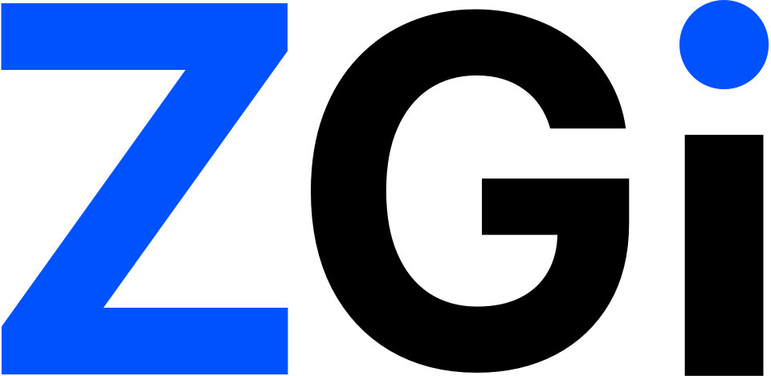
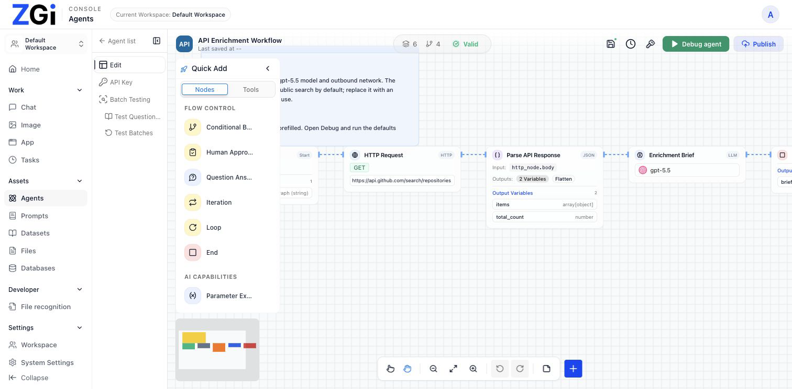

<p align="center">
  <picture>
    <source media="(prefers-color-scheme: dark)" srcset="web/public/logo_dark.png" />
    
  </picture>
</p>

# ZGI

<p align="center">
  <em>Build, run, and operate AI agents, workflows, skills, knowledge, and model routes from one workspace.</em>
</p>

<p align="center">
  <a href="LICENSE"></a>
  <a href="#quick-start"></a>
  <a href="web"></a>
  <a href="api"></a>
</p>

<p align="center">
  <sub>
    <a href="#why-zgi">Why ZGI</a> &middot;
    <a href="#platform">Platform</a> &middot;
    <a href="#quick-start">Quick Start</a> &middot;
    <a href="#architecture">Architecture</a> &middot;
    <a href="#development">Development</a> &middot;
    <a href="#documentation">Docs</a> &middot;
    <a href="#license">License</a>
  </sub>
</p>



## Why ZGI

ZGI is a source-available AI application platform for teams that need more than
a chat box. It brings agent apps, visual workflow orchestration, model
operations, knowledge retrieval, reusable skills, and runtime services into one
self-hostable product surface.

Use it to prototype internal AI tools, publish agent experiences, route model
traffic through controlled providers, compose multi-step automations, and keep
runtime infrastructure close to your own workspace.

## Platform

| Area | What you can build |
| --- | --- |
| **Agent applications** | Configure instructions, model settings, knowledge, memory, file upload, skills, and web app publishing from the console. |
| **Visual workflows** | Compose API calls, JSON parsing, LLM steps, branching, loops, approvals, tools, code execution, database access, notifications, and retrieval on a canvas. |
| **Model operations** | Manage providers, channels, credentials, defaults, policy controls, and pricing metadata without scattering model configuration across apps. |
| **Knowledge and skills** | Connect datasets, content parsing, retrieval, and reusable tool skills so agents can work with real workspace context. |
| **Runtime services** | Run the Go API, Next.js console, sandbox, plugin runner, PostgreSQL, and Redis behind a local gateway at `http://localhost:2679`. |
| **Starter templates** | Explore 23 built-in agent and workflow templates in English and Simplified Chinese. |

## Quick Start

Start the full local stack:

```bash
make dev-docker
```

If you do not have `make`, run the startup script directly:

```bash
./dev/start-docker
```

Open the console:

```text
http://localhost:2679
```

On first launch, create the first administrator account. ZGI does not ship with
a default admin account.

### Docker Profiles

| Command | Services |
| --- | --- |
| `./dev/start-docker --core` | Core product preview |
| `./dev/start-docker --runtime` | Core stack plus Sandbox and Runner |
| `./dev/start-docker --knowledge` | Core stack plus knowledge dependencies |
| `./dev/start-docker --full` | Full stack, same as the default |

Stop the stack:

```bash
make docker-down
```

View logs:

```bash
make docker-logs
```

## Architecture

```text
Browser
  |
  v
Nginx gateway (:2679)
  |
  +-- Next.js console (web)
  +-- Go API service
        |
        +-- PostgreSQL / Redis
        +-- Sandbox service
        +-- Plugin runner
        +-- Optional knowledge services: Weaviate / Neo4j
```

## Repository Layout

```text
.
+-- api/             Go backend service
+-- web/             Next.js web console
+-- sandbox/         Isolated execution service
+-- runner/          Plugin execution service
+-- docker/          Product-level Docker Compose assets
+-- dev/             Local development scripts
+-- scripts/         Maintenance scripts
+-- docs/            Public documentation and assets
+-- Makefile         Common local entry points
+-- README.md
```

## Development

Install the local toolchain first:

- Docker and Docker Compose
- Make
- Go, for backend source development
- Node.js and pnpm, for frontend source development

The web app uses `pnpm@10.12.1`.

Install and prepare dependencies:

```bash
make setup
```

Start shared infrastructure:

```bash
make dev-docker
```

Run backend and frontend from source in separate terminals:

```bash
make dev-api
make dev-web
```

## Documentation

- Product-level Docker notes: [`docker/README.md`](docker/README.md)
- Release process: [`docs/release-process.md`](docs/release-process.md)
- Script skill input files: [`docs/script-skill-input-files.md`](docs/script-skill-input-files.md)
- Web app notes: [`web/README.md`](web/README.md)
- Backend service docs: [`api/`](api/)

## Contributing

Contributions are welcome. Please read [`CONTRIBUTING.md`](CONTRIBUTING.md)
before opening a pull request.

Community expectations are documented in
[`CODE_OF_CONDUCT.md`](CODE_OF_CONDUCT.md).

For security-sensitive reports, follow [`SECURITY.md`](SECURITY.md).

## License

ZGI is source-available under the ZGI Community License, based on Apache License
2.0 with additional conditions. ZGI is free for personal, research,
educational, and internal organizational use. Hosted multi-tenant services,
white-label distribution, and removal of official ZGI branding require a
commercial license. See [`LICENSE`](LICENSE) for details.

The Apache License 2.0 text referenced by the ZGI Community License is included
in [`LICENSE-APACHE`](LICENSE-APACHE).
