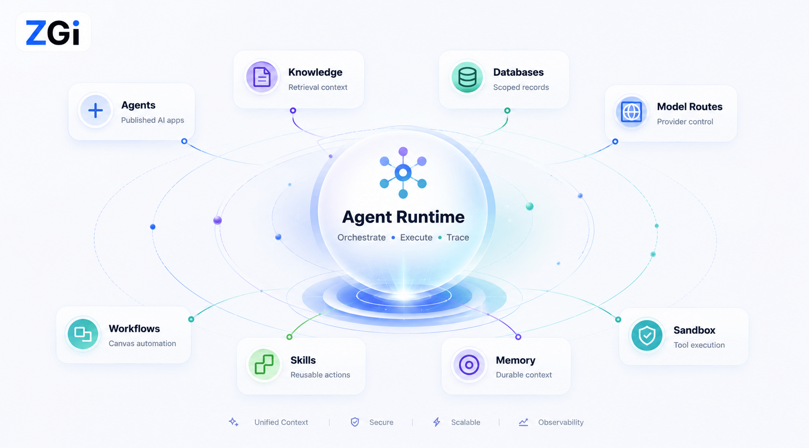

<p align="center">
  
</p>

# ZGI

<p align="center">
  <em>An Agent Runtime workspace with source code available for building, running, and operating AI agents, workflows, skills, knowledge, and model routes.</em>
</p>

<p align="center">
  <a href="https://github.com/zgiai/zgi/stargazers"></a>
  <a href="LICENSE"></a>
  <a href="#quick-start"></a>
  <a href="web"></a>
  <a href="api"></a>
</p>

<p align="center">
  <sub>
    <a href="#why-zgi">Why ZGI</a> &middot;
    <a href="#platform">Platform</a> &middot;
    <a href="#quick-start">Quick Start</a> &middot;
    <a href="#development">Development</a> &middot;
    <a href="#documentation">Docs</a> &middot;
    <a href="#contributing">Contributing</a> &middot;
    <a href="#license">License</a>
  </sub>
</p>

## Why ZGI

ZGI is an Agent Runtime platform with source code available for teams that need
AI apps to do real work, not just answer in a chat box. It combines agent
applications, visual workflow orchestration, model routing, workspace knowledge,
database access, memory, reusable skills, and sandboxed tool execution in one
self-hostable workspace.

Use it to build internal AI tools, publish agent experiences, bind agents to
approved knowledge, databases, and workflows, run skill-powered tasks such as
file generation, charts, reports, scheduling, and calculations, and keep runtime
control close to your own systems.

## Platform

| Area | What you can build |
| --- | --- |
| **Agent apps** | Publish assistants with instructions, model settings, memory, knowledge, file upload, and skills. |
| **Workflow automation** | Build multi-step processes with LLM calls, branches, loops, approvals, code execution, notifications, and retrieval. |
| **Runtime skills** | Give agents reusable capabilities for files, charts, reports, scheduling, calculations, databases, and workflow calls. |
| **Knowledge and data** | Bind agents to approved knowledge bases and database tables instead of exposing broad workspace access. |
| **Model routing** | Manage providers, model defaults, credentials, policies, and pricing metadata in one place. |
| **Self-hosted runtime** | Run the console, API, sandbox, runner, PostgreSQL, and Redis locally or in your own infrastructure. |

## Quick Start

Start the full local stack:

```bash
make dev-docker
```

If you do not have `make`, run the startup script directly:

```bash
./dev/start-docker
```

Open the console:

```text
http://localhost:2679
```

On first launch, create the first administrator account. ZGI does not ship with
a default admin account.

Stop the stack:

```bash
make docker-down
```

View logs:

```bash
make docker-logs
```

## Development

For source development, install:

- Docker and Docker Compose
- Make
- Go
- Node.js and pnpm

The web app uses `pnpm@10.12.1`.

Prepare dependencies:

```bash
make setup
```

Run the API and web app from source in separate terminals:

```bash
make dev-docker
make dev-api
make dev-web
```

## Documentation

Read the product documentation at [`docs.zgi.ai`](https://docs.zgi.ai).

Repository-local README files are kept for development and contribution notes.
For deployment behavior such as the embedded system skill catalog, see
[`docker/README.md`](docker/README.md#system-skill-catalog).

## Contributing

Contributions are welcome. Please read [`CONTRIBUTING.md`](CONTRIBUTING.md)
before opening a pull request.

Community expectations are documented in
[`CODE_OF_CONDUCT.md`](CODE_OF_CONDUCT.md).

For security-sensitive reports, follow [`SECURITY.md`](SECURITY.md).

## License

ZGI source code is available under the ZGI Community License, based on Apache
License 2.0 with additional conditions. ZGI is free for personal, research,
educational, and internal organizational use. Hosted multi-tenant services,
white-label distribution, and removal of official ZGI branding require a
commercial license. This license is not an OSI-approved open source license.
See [`LICENSE`](LICENSE) for details.

The Apache License 2.0 text referenced by the ZGI Community License is included
in [`LICENSE-APACHE`](LICENSE-APACHE).
