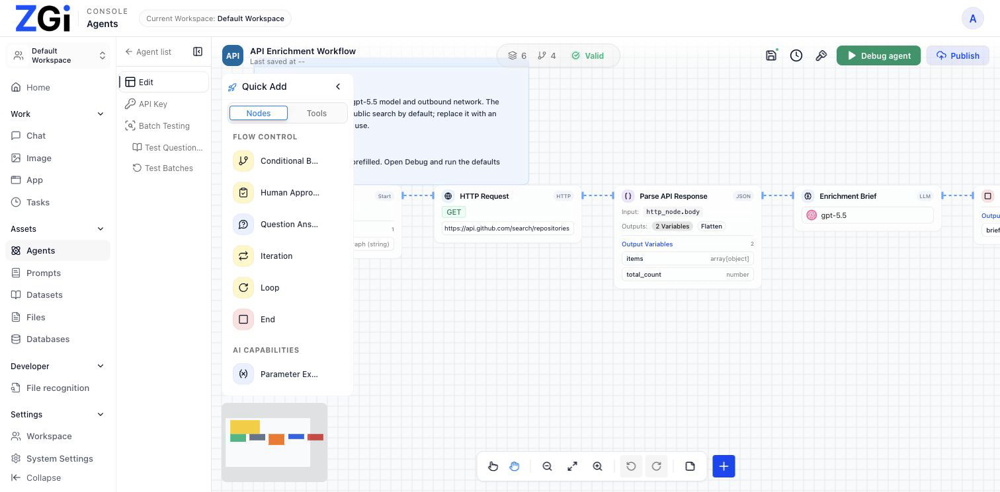

# ZGI

<p align="center">
  English &middot;
  <a href="README.zh-CN.md">简体中文</a> &middot;
  <a href="README.ja-JP.md">日本語</a> &middot;
  <a href="README.ko-KR.md">한국어</a>
</p>

<p align="center">
  <em>A source-available Agent Runtime workspace for building, connecting, publishing, and operating AI agents and executable workflows.</em>
</p>

<p align="center">
  <a href="https://github.com/zgiai/zgi/stargazers"></a>
  <a href="LICENSE"></a>
  <a href="#quick-start"></a>
  <a href="web"></a>
  <a href="api"></a>
</p>

<p align="center">
  <sub>
    <a href="#why-zgi">Why ZGI</a> &middot;
    <a href="#from-build-to-runtime">How it works</a> &middot;
    <a href="#core-capabilities">Capabilities</a> &middot;
    <a href="#quick-start">Quick Start</a> &middot;
    <a href="#development">Development</a> &middot;
    <a href="#documentation">Docs</a> &middot;
    <a href="#contributing">Contributing</a> &middot;
    <a href="#license">License</a>
  </sub>
</p>



## Why ZGI

ZGI is an Agent Runtime platform with source code available for teams that need
AI applications to execute real work, not just answer in a chat box. It brings
agent configuration, visual workflow orchestration, advanced retrieval,
structured data, model routing, reusable skills, and sandboxed execution into
one self-hostable workspace.

Build an agent once, bind it to approved knowledge, databases, skills, and
workflows, then make it available through a WebApp, the internal app center, an
API, or scheduled and internal calls. Permissions, runtime logs, and batch tests
keep the application observable and governable after it is published.

## From Build to Runtime

```text
Build agents and workflows
        ↓
Connect models, knowledge, databases, files, and skills
        ↓
Execute tools, code, retrieval, and human-in-the-loop steps
        ↓
Publish through WebApp, App Center, API, or internal invocation
        ↓
Operate with permissions, logs, and batch testing
```

## Core Capabilities

| Area | What ZGI provides |
| --- | --- |
| **Agent applications** | Configure instructions, models, memory, knowledge, file inputs, skills, and workflow bindings, then publish a usable agent experience. |
| **Executable workflows** | Orchestrate LLM calls, branches, loops, approvals, user questions, HTTP requests, database operations, code, documents, notifications, and scheduled tasks on a visual canvas. |
| **Advanced retrieval** | Combine semantic, full-text, hybrid, and knowledge-graph retrieval with reranking, while keeping agents scoped to approved knowledge and data. |
| **Skills and sandboxed tools** | Package reusable capabilities for files, charts, reports, calculations, databases, and workflow calls, and execute them in an isolated runtime. |
| **Model gateway** | Manage providers, channels, credentials, defaults, routing policies, quotas, and pricing metadata in one place. |
| **Publishing and governance** | Expose agents through WebApp, App Center, API keys, or internal calls, with workspace permissions, runtime logs, and reusable batch tests. |
| **Self-hosted runtime** | Run the console, API, sandbox, runner, PostgreSQL, and Redis locally or in your own infrastructure. |

## Quick Start

Start the full local stack:

```bash
make dev-docker
```

If you do not have `make`, run the startup script directly:

```bash
./dev/start-docker
```

Open the console:

```text
http://localhost:2679
```

On first launch, create the first administrator account. ZGI does not ship with
a default admin account.

Stop the stack:

```bash
make docker-down
```

View logs:

```bash
make docker-logs
```

## Development

For source development, install:

- Docker and Docker Compose
- Make
- Go
- Node.js and pnpm

The web app uses `pnpm@10.12.1`.

Prepare dependencies:

```bash
make setup
```

Run the API and web app from source in separate terminals:

```bash
make dev-docker
make dev-api
make dev-web
```

## Documentation

Read the product documentation at [`docs.zgi.ai`](https://docs.zgi.ai).

Repository-local README files are kept for development and contribution notes.
For deployment behavior such as the embedded system skill catalog, see
[`docker/README.md`](docker/README.md#system-skill-catalog).
For external application Connections, credential rotation, grants, health, and
AIChat usage, see [`docs/external-integrations.md`](docs/external-integrations.md).
The Exa-specific setup is documented in [`docs/web-search.md`](docs/web-search.md).

## Contributing

Contributions are welcome. Please read [`CONTRIBUTING.md`](CONTRIBUTING.md)
before opening a pull request.

Community expectations are documented in
[`CODE_OF_CONDUCT.md`](CODE_OF_CONDUCT.md).

For security-sensitive reports, follow [`SECURITY.md`](SECURITY.md).

## License

ZGI source code is available under the ZGI Community License, based on Apache
License 2.0 with additional conditions. ZGI is free for personal, research,
educational, and internal organizational use. Hosted multi-tenant services,
white-label distribution, and removal of official ZGI branding require a
commercial license. This license is not an OSI-approved open source license.
See [`LICENSE`](LICENSE) for details.

The Apache License 2.0 text referenced by the ZGI Community License is included
in [`LICENSE-APACHE`](LICENSE-APACHE).
