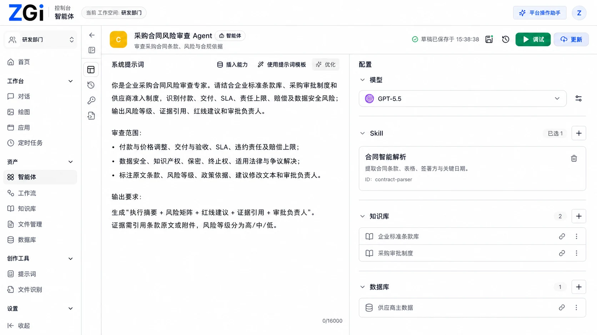
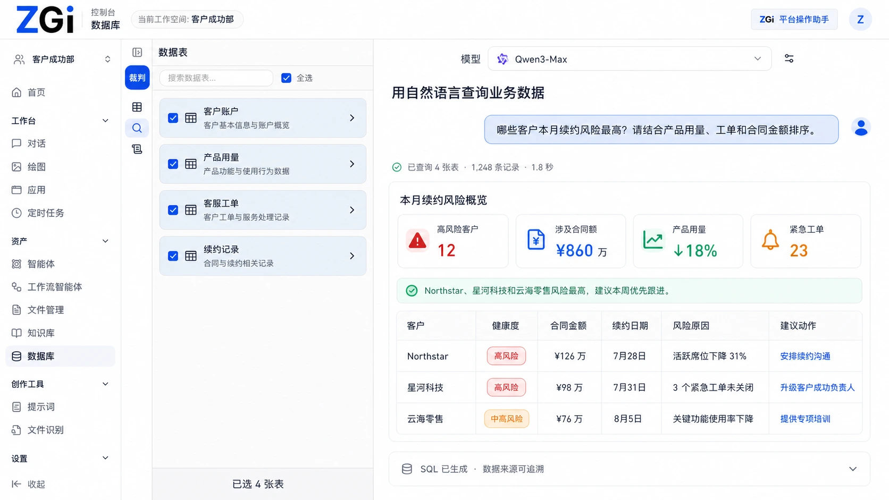
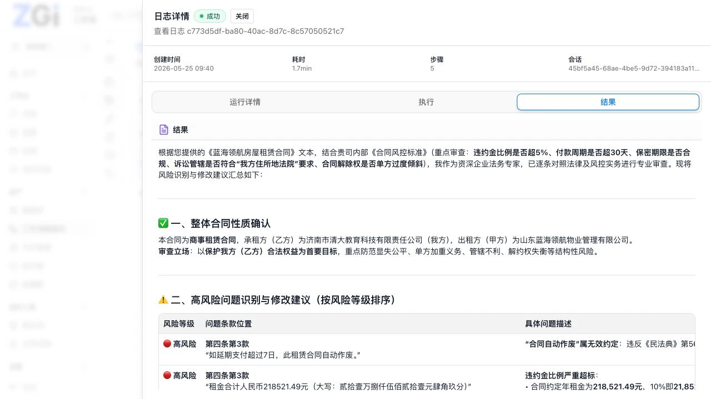
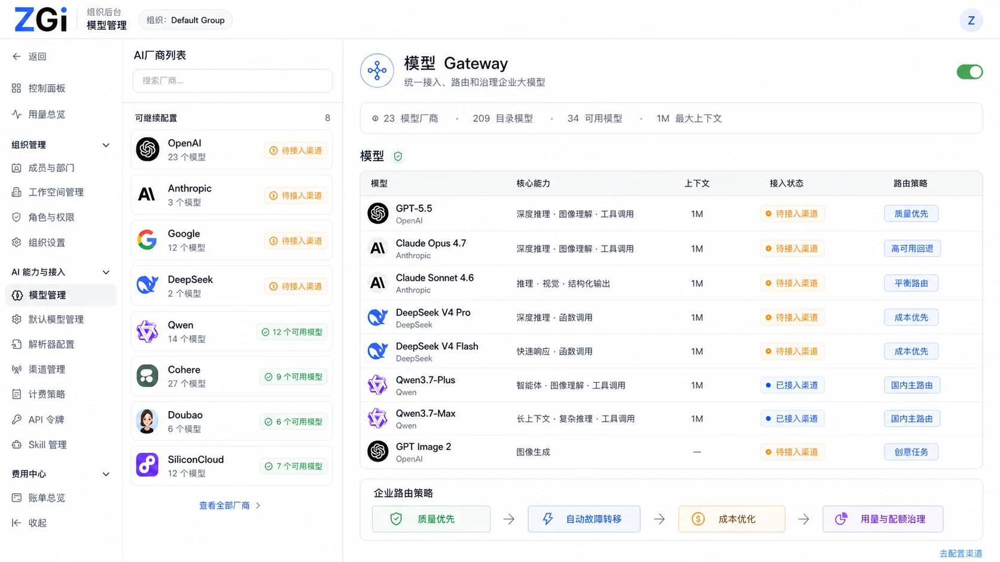
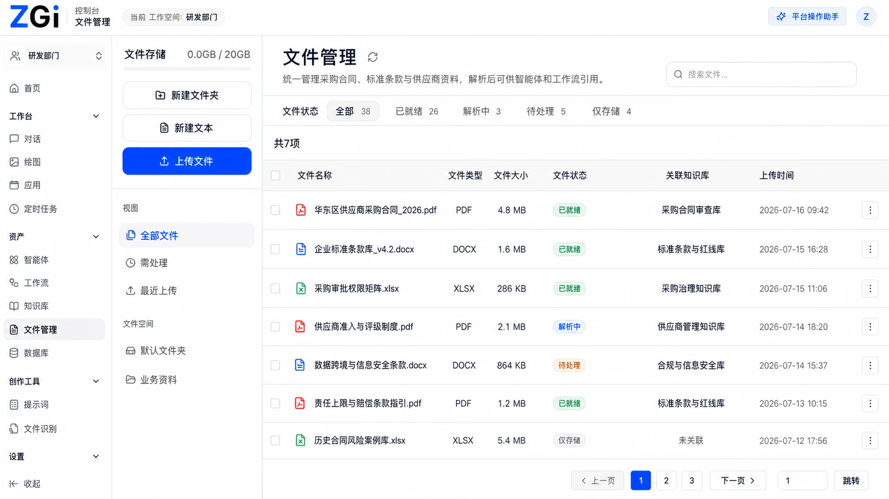

# ZGI

<p align="center">
  <a href="README.md">English</a> &middot;
  简体中文 &middot;
  <a href="README.ja-JP.md">日本語</a> &middot;
  <a href="README.ko-KR.md">한국어</a>
</p>

<p align="center">
  <em>一个源码可用的 Agent Runtime 工作空间，用于构建、连接、发布和运营 AI Agent 与可执行工作流。</em>
</p>

<p align="center">
  <a href="https://github.com/zgiai/zgi/stargazers"></a>
  <a href="LICENSE"></a>
  <a href="#快速开始"></a>
  <a href="web"></a>
  <a href="api"></a>
</p>

<p align="center">
  <sub>
    <a href="#为什么选择-zgi">为什么选择 ZGI</a> &middot;
    <a href="#从构建到运行">工作方式</a> &middot;
    <a href="#核心能力">核心能力</a> &middot;
    <a href="#产品一览">产品一览</a> &middot;
    <a href="#快速开始">快速开始</a> &middot;
    <a href="#开发">开发</a> &middot;
    <a href="#文档">文档</a> &middot;
    <a href="#参与贡献">参与贡献</a> &middot;
    <a href="#许可证">许可证</a>
  </sub>
</p>



## 为什么选择 ZGI

ZGI 是一个源码可用的 Agent Runtime 平台，面向希望 AI 应用真正执行任务、而不仅仅是在聊天框中回答问题的团队。它将 Agent 配置、可视化工作流编排、高级知识检索、结构化数据、模型路由、可复用技能和沙箱化执行整合到一个可自托管的工作空间中。

你可以一次构建 Agent，将它绑定到经过授权的知识库、数据库、技能和工作流，再通过 WebApp、内部应用中心、API、定时任务或内部调用交付给用户。发布后，可以继续使用权限、运行日志和批量测试对应用进行观测和治理。

## 从构建到运行

```text
构建 Agent 与工作流
        ↓
连接模型、知识库、数据库、文件和技能
        ↓
执行工具、代码、知识检索和人工参与步骤
        ↓
通过 WebApp、应用中心、API 或内部调用发布
        ↓
使用权限、日志和批量测试持续运营
```

## 核心能力

| 领域 | ZGI 提供什么 |
| --- | --- |
| **Agent 应用** | 配置指令、模型、记忆、知识库、文件输入、技能和工作流绑定，并发布可直接使用的 Agent 应用。 |
| **可执行工作流** | 在可视化画布上编排 LLM 调用、分支、循环、审批、用户追问、HTTP 请求、数据库操作、代码、文档、通知和定时任务。 |
| **高级知识检索** | 组合语义、全文、混合和知识图谱检索与重排，同时将 Agent 的访问范围限制在经过授权的知识和数据中。 |
| **技能与沙箱工具** | 将文件、图表、报告、计算、数据库和工作流调用封装为可复用能力，并在隔离运行时中执行。 |
| **模型网关** | 在一个位置管理模型提供商、渠道、凭据、默认模型、路由策略、配额和定价元数据。 |
| **发布与治理** | 通过 WebApp、应用中心、API Key 或内部调用交付 Agent，并使用工作空间权限、运行日志和可复用批量测试进行治理。 |
| **自托管运行时** | 在本地或自己的基础设施中运行控制台、API、沙箱、Runner、PostgreSQL 和 Redis。 |

## 产品一览

下面继续展示 Agent 如何通过工作流编排连接业务数据、执行任务，并完成模型治理与企业知识应用。

### 编排可执行工作流

在可视化画布上连接文档提取、知识检索、模型、工具、审批与输出。


### 用自然语言分析业务数据

选择受控的数据表，用自然语言提问，并获得可追溯的指标、风险与行动建议。



### 检查运行结果

查看运行状态、耗时、步骤与结构化输出，确认工作流执行了什么、返回了什么。



### 治理模型与渠道

统一管理模型提供商、渠道、路由策略和可用性。



### 让 Agent 基于企业文件工作

上传并处理文件，再将它们关联到已授权的知识库，供 Agent 和工作流使用。



## 快速开始

启动完整的本地服务：

```bash
make dev-docker
```

如果没有安装 `make`，可以直接运行启动脚本：

```bash
./dev/start-docker
```

打开控制台：

```text
http://localhost:2679
```

首次启动时，请创建第一个管理员账户。ZGI 不提供默认管理员账户。

停止服务：

```bash
make docker-down
```

查看日志：

```bash
make docker-logs
```

## 开发

从源代码进行开发前，请安装：

- Docker 和 Docker Compose
- Make
- Go
- Node.js 和 pnpm

Web 应用使用 `pnpm@10.12.1`。

准备项目依赖：

```bash
make setup
```

分别在不同的终端中启动 API 和 Web 应用：

```bash
make dev-docker
make dev-api
make dev-web
```

## 文档

请访问 [`docs.zgi.ai`](https://docs.zgi.ai) 阅读产品文档。

仓库中的其他 README 文件主要用于记录开发与贡献说明。有关内置系统技能目录等部署行为，请参阅 [`docker/README.md`](docker/README.md#system-skill-catalog)。

## 参与贡献

欢迎参与贡献。提交 Pull Request 前，请先阅读 [`CONTRIBUTING.md`](CONTRIBUTING.md)。

社区行为准则请参阅 [`CODE_OF_CONDUCT.md`](CODE_OF_CONDUCT.md)。

如需报告安全相关问题，请遵循 [`SECURITY.md`](SECURITY.md) 中的说明。

## 许可证

ZGI 源代码根据 ZGI Community License 提供。该许可证以 Apache License 2.0 为基础，并包含附加条件。ZGI 可免费用于个人、研究、教育和组织内部用途。提供托管式多租户服务、进行白标分发或移除 ZGI 官方品牌标识，需要获得商业许可证。该许可证并非 OSI 认可的开源许可证。详情请参阅 [`LICENSE`](LICENSE)。

ZGI Community License 所引用的 Apache License 2.0 文本收录于 [`LICENSE-APACHE`](LICENSE-APACHE)。
