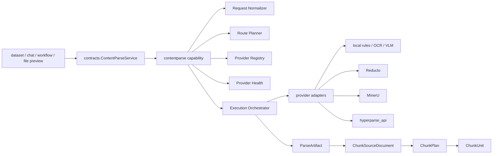

# Content Parse Provider-Policy Architecture

Date: 2026-05-16

Status: Proposed

Scope:
- Keep current dataset/file_process business behavior unchanged
- Introduce an independent provider-policy platform for content parsing
- Prepare a migration path from `extraction_strategy + fixed fallback` to `provider orchestration + canonical IR`

## Product Principles

### User-facing
- Do not expose provider names
- Only expose parse modes and parse results
- Recommended modes:
  - `auto`
  - `high_quality`
  - `fast`
  - `local_first`

### Admin-facing
- Configure providers
- Configure routing policies
- Inspect provider health, cost, degradation, and fallback behavior

### System-facing
- Normalize all provider outputs into Canonical IR
- Keep providers pluggable
- Make route policy configurable
- Treat self-built `local / OCR / VLM` as the system fallback chain

## Current vs Target

| Area | Current behavior | Target behavior |
|---|---|---|
| Business entry | Users choose `mineru/local/reducto/...` | Users choose `mode`; provider selection is automatic |
| Admin control | No dedicated provider platform | Dedicated provider config, policy config, health, and cost surfaces |
| Routing | Document-level `extraction_strategy` + fixed fallback order | Policy-based route planner using provider availability, file type, mode, privacy, and cost |
| Self-built capability | Participates as a normal strategy | Explicit system fallback chain |
| Output contract | Legacy `ExtractOutput` implicit contract | `ParseArtifact -> ChunkSourceDocument -> ChunkPlan -> ChunkUnit` |
| Migration | Directly on main path | Independent shadow-first migration |

## Architecture Direction



## Non-goals for Phase 1

The first phase must not:
- replace current dataset indexing
- remove current `extraction_strategy`
- change current retrieval behavior
- change current file preview behavior
- require frontend changes for ordinary users

The first phase should only add:
- independent tables
- independent repositories/services/handlers
- independent route planning and provider health records
- shadow data for future comparison

## New Tables

These tables are independent and do not replace any current business tables in phase 1.

### 1. `content_parse_provider_configs`

Purpose:
- Persist provider configuration per system or workspace scope

Suggested columns:
- `id UUID PRIMARY KEY`
- `scope VARCHAR(32) NOT NULL`
- `workspace_id UUID NULL`
- `provider_key VARCHAR(64) NOT NULL`
- `provider_type VARCHAR(32) NOT NULL`
- `display_name VARCHAR(128) NOT NULL`
- `enabled BOOLEAN NOT NULL DEFAULT TRUE`
- `priority INTEGER NOT NULL DEFAULT 100`
- `adapter_name VARCHAR(64) NOT NULL`
- `engine_name VARCHAR(64) NULL`
- `base_url TEXT NULL`
- `credentials_ciphertext JSONB NULL`
- `timeout_sec INTEGER NOT NULL DEFAULT 180`
- `supports_file_types JSONB NOT NULL DEFAULT '[]'`
- `supports_profiles JSONB NOT NULL DEFAULT '[]'`
- `cost_level VARCHAR(32) NULL`
- `privacy_level VARCHAR(32) NULL`
- `metadata JSONB NOT NULL DEFAULT '{}'`
- `created_by UUID NULL`
- `updated_by UUID NULL`
- `created_at TIMESTAMPTZ NOT NULL DEFAULT NOW()`
- `updated_at TIMESTAMPTZ NOT NULL DEFAULT NOW()`

Indexes:
- `(scope, workspace_id, enabled, priority)`
- unique `(scope, workspace_id, provider_key)`

### 2. `content_parse_route_policies`

Purpose:
- Define high-level policies corresponding to user-facing modes

Suggested columns:
- `id UUID PRIMARY KEY`
- `scope VARCHAR(32) NOT NULL`
- `workspace_id UUID NULL`
- `policy_key VARCHAR(64) NOT NULL`
- `display_name VARCHAR(128) NOT NULL`
- `enabled BOOLEAN NOT NULL DEFAULT TRUE`
- `allow_remote BOOLEAN NOT NULL DEFAULT TRUE`
- `allow_fallback BOOLEAN NOT NULL DEFAULT TRUE`
- `metadata JSONB NOT NULL DEFAULT '{}'`
- `created_by UUID NULL`
- `updated_by UUID NULL`
- `created_at TIMESTAMPTZ NOT NULL DEFAULT NOW()`
- `updated_at TIMESTAMPTZ NOT NULL DEFAULT NOW()`

Indexes:
- unique `(scope, workspace_id, policy_key)`

### 3. `content_parse_route_policy_rules`

Purpose:
- Store detailed route matching and fallback behavior

Suggested columns:
- `id UUID PRIMARY KEY`
- `policy_id UUID NOT NULL REFERENCES content_parse_route_policies(id) ON DELETE CASCADE`
- `match_file_types JSONB NOT NULL DEFAULT '[]'`
- `match_mime_prefix VARCHAR(128) NULL`
- `match_is_scanned BOOLEAN NULL`
- `preferred_provider_order JSONB NOT NULL DEFAULT '[]'`
- `fallback_provider_order JSONB NOT NULL DEFAULT '[]'`
- `require_local BOOLEAN NOT NULL DEFAULT FALSE`
- `allow_vlm BOOLEAN NOT NULL DEFAULT TRUE`
- `max_timeout_sec INTEGER NULL`
- `sort_order INTEGER NOT NULL DEFAULT 100`
- `metadata JSONB NOT NULL DEFAULT '{}'`
- `created_at TIMESTAMPTZ NOT NULL DEFAULT NOW()`
- `updated_at TIMESTAMPTZ NOT NULL DEFAULT NOW()`

Indexes:
- `(policy_id, sort_order)`

### 4. `content_parse_provider_health_checks`

Purpose:
- Persist provider health snapshots for admin inspection and route decisions

Suggested columns:
- `id UUID PRIMARY KEY`
- `provider_config_id UUID NOT NULL REFERENCES content_parse_provider_configs(id) ON DELETE CASCADE`
- `status VARCHAR(32) NOT NULL`
- `latency_ms INTEGER NULL`
- `error_message TEXT NULL`
- `details JSONB NOT NULL DEFAULT '{}'`
- `checked_at TIMESTAMPTZ NOT NULL DEFAULT NOW()`

Indexes:
- `(provider_config_id, checked_at DESC)`
- `(status, checked_at DESC)`

### 5. `content_parse_runs`

Purpose:
- Persist parse execution records, especially for shadow comparison

Suggested columns:
- `id UUID PRIMARY KEY`
- `workspace_id UUID NULL`
- `dataset_id UUID NULL`
- `document_id UUID NULL`
- `file_id UUID NULL`
- `source_type VARCHAR(32) NOT NULL`
- `source_ref TEXT NULL`
- `file_name TEXT NULL`
- `intent VARCHAR(32) NOT NULL`
- `profile VARCHAR(64) NOT NULL`
- `policy_key VARCHAR(64) NULL`
- `route_policy_id UUID NULL REFERENCES content_parse_route_policies(id) ON DELETE SET NULL`
- `requested_provider_key VARCHAR(64) NULL`
- `planned_provider_order JSONB NOT NULL DEFAULT '[]'`
- `attempted_provider_order JSONB NOT NULL DEFAULT '[]'`
- `final_provider_key VARCHAR(64) NULL`
- `adapter_name VARCHAR(64) NULL`
- `engine_name VARCHAR(64) NULL`
- `status VARCHAR(32) NOT NULL`
- `quality_level VARCHAR(32) NOT NULL`
- `fallback_used BOOLEAN NOT NULL DEFAULT FALSE`
- `duration_ms INTEGER NULL`
- `artifact_storage_key TEXT NULL`
- `diagnostics_storage_key TEXT NULL`
- `summary_json JSONB NOT NULL DEFAULT '{}'`
- `created_at TIMESTAMPTZ NOT NULL DEFAULT NOW()`

Indexes:
- `(workspace_id, created_at DESC)`
- `(dataset_id, document_id, created_at DESC)`
- `(status, quality_level, created_at DESC)`
- `(final_provider_key, created_at DESC)`

### 6. `content_parse_artifacts`

Purpose:
- Persist reusable canonical parse artifacts independent from individual parse runs

Suggested columns:
- `id UUID PRIMARY KEY`
- `source_content_hash VARCHAR(255) NOT NULL`
- `profile VARCHAR(64) NOT NULL`
- `canonical_ir_version VARCHAR(64) NOT NULL`
- `provider_signature VARCHAR(128) NOT NULL`
- `artifact_storage_key TEXT NULL`
- `diagnostics_storage_key TEXT NULL`
- `summary_json JSONB NOT NULL DEFAULT '{}'`
- `created_at TIMESTAMPTZ NOT NULL DEFAULT NOW()`
- `updated_at TIMESTAMPTZ NOT NULL DEFAULT NOW()`
- `deleted_at TIMESTAMPTZ NULL`

Indexes:
- unique `(source_content_hash, profile, canonical_ir_version, provider_signature)`
- `(deleted_at)`

### 7. `content_parse_chunking_runs`

Purpose:
- Persist chunking shadow results derived from Canonical IR

Suggested columns:
- `id UUID PRIMARY KEY`
- `parse_run_id UUID NOT NULL REFERENCES content_parse_runs(id) ON DELETE CASCADE`
- `use_case VARCHAR(32) NOT NULL`
- `planner_name VARCHAR(64) NOT NULL`
- `parent_mode VARCHAR(64) NULL`
- `segmentation VARCHAR(64) NULL`
- `unit_count INTEGER NOT NULL DEFAULT 0`
- `plan_json JSONB NOT NULL DEFAULT '{}'`
- `artifact_storage_key TEXT NULL`
- `created_at TIMESTAMPTZ NOT NULL DEFAULT NOW()`

Indexes:
- `(parse_run_id, created_at DESC)`
- `(use_case, created_at DESC)`

## No-touch Existing Tables in Phase 1

These remain unchanged in the first migration phase:
- `documents`
- `datasets`
- `dataset_process_rules`
- `upload_files`
- current vector/chunk persistence tables

Current main business continues to read and write them exactly as today.

## Directory Changes

### New independent module

```text
internal/modules/contentparse
├── README.md
├── module.go
├── model
│   ├── provider_config.go
│   ├── route_policy.go
│   ├── route_policy_rule.go
│   ├── provider_health_check.go
│   ├── artifact.go
│   ├── parse_run.go
│   └── chunking_run.go
├── repository
│   ├── provider_config_repository.go
│   ├── route_policy_repository.go
│   ├── provider_health_repository.go
│   ├── artifact_repository.go
│   ├── parse_run_repository.go
│   └── chunking_run_repository.go
├── service
│   ├── provider_admin_service.go
│   ├── policy_admin_service.go
│   ├── health_service.go
│   ├── artifact_service.go
│   └── run_query_service.go
└── handler
    ├── provider_handler.go
    ├── policy_handler.go
    ├── health_handler.go
    ├── artifact_handler.go
    └── run_handler.go
```

### Recommended additions under existing capability

```text
internal/capabilities/contentparse
├── routing
│   ├── route_plan.go
│   ├── planner.go
│   ├── selector.go
│   ├── policy_matcher.go
│   └── fallback.go
├── health
│   ├── checker.go
│   └── snapshot.go
├── observation
│   ├── run_recorder.go
│   ├── shadow_writer.go
│   └── summary_builder.go
├── normalization
│   ├── artifact_normalizer.go
│   └── provenance.go
├── adapters
├── chunking
└── engines
```

These additions stay fully compatible with the current capability layout.

## Suggested Gorm Model Drafts

The following model packages should use the same conventions as current repo models:
- `uuid.UUID` primary keys
- explicit `TableName()`
- `time.Time` audit columns
- `gorm.DeletedAt` only when soft delete is truly needed

Recommended soft-delete usage:
- `content_parse_provider_configs`
- `content_parse_route_policies`

Recommended append-only tables:
- `content_parse_provider_health_checks`
- `content_parse_artifacts`
- `content_parse_runs`
- `content_parse_chunking_runs`

## Migration Files

Suggested new migration files:

```text
internal/migrations
├── m0149_create_content_parse_provider_tables.go
├── m0150_create_content_parse_policy_tables.go
├── m0151_create_content_parse_run_tables.go
├── m0152_create_content_parse_chunking_run_tables.go
└── m0153_create_content_parse_artifact_tables.go
```

Recommended execution order:
1. provider config tables
2. policy tables
3. parse run tables
4. chunking run tables
5. artifact tables

## Incremental Rollout Plan

### Phase 1
- create independent tables
- add independent module and repositories
- no main-path read/write changes

### Phase 2
- add route-planner foundation
- add route-policy shadow generation
- store route-planning outputs in `content_parse_runs`

### Phase 3
- add parse shadow generation
- store `ParseArtifact` summary without replacing current extraction result

### Phase 4
- add chunking shadow generation
- compare `ChunkPlan` and `ChunkUnit` against current indexing behavior

### Phase 5
- cut over low-risk surfaces first
  - preview
  - workflow

### Phase 6
- gradually migrate dataset indexing and later chat attachment

## Why this does not affect current business

- no replacement of current tables
- no replacement of current service wiring
- no change to current extraction strategy validation
- all new state lives in isolated tables and isolated module directories
- migration strategy is shadow-first, not switch-first

## Decision

Use an independent `content parse policy platform` inside `zgi-api`:
- independent tables
- independent repositories and services
- independent admin and diagnostics surface
- capability-level Canonical IR
- gradual migration through shadow data and route-policy comparison
