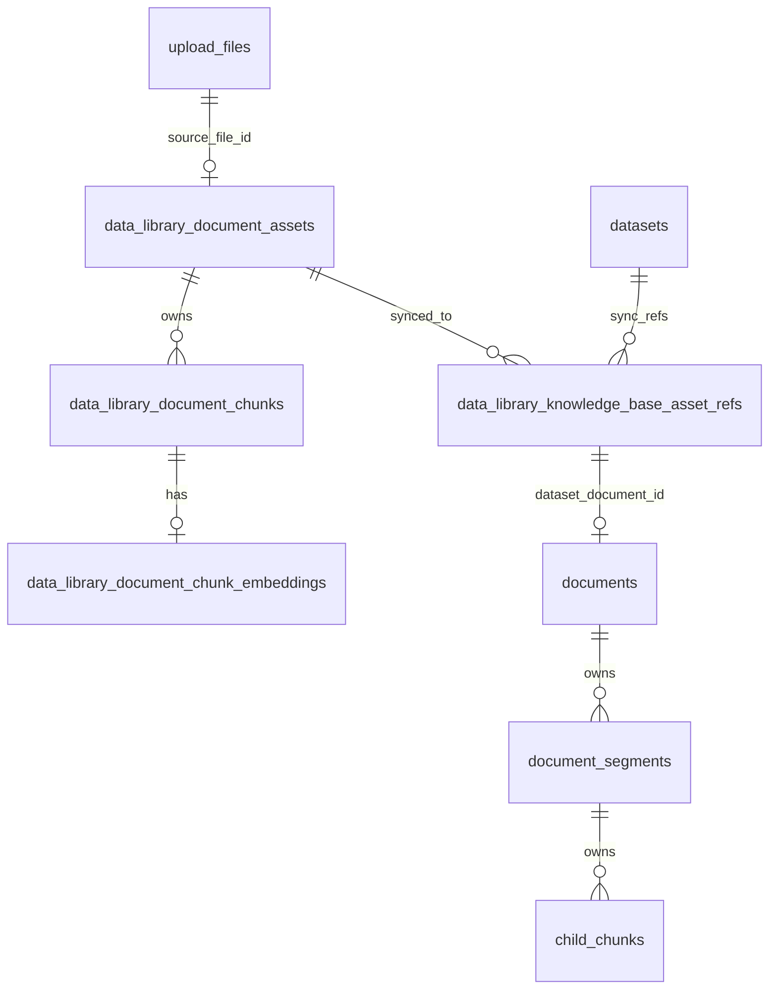
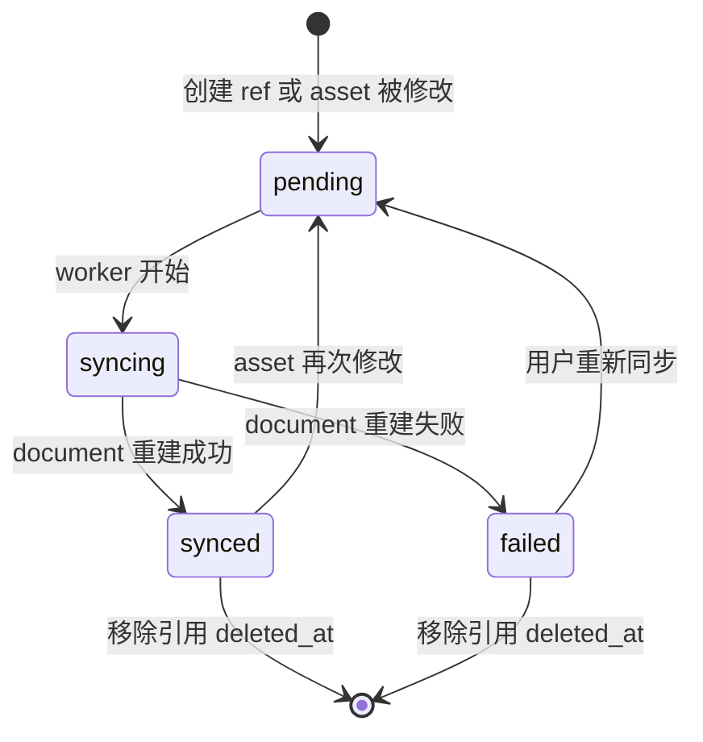
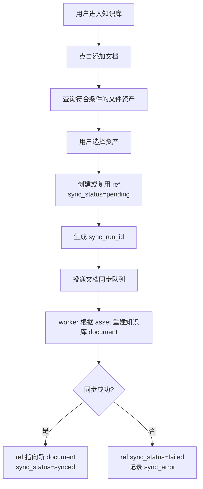
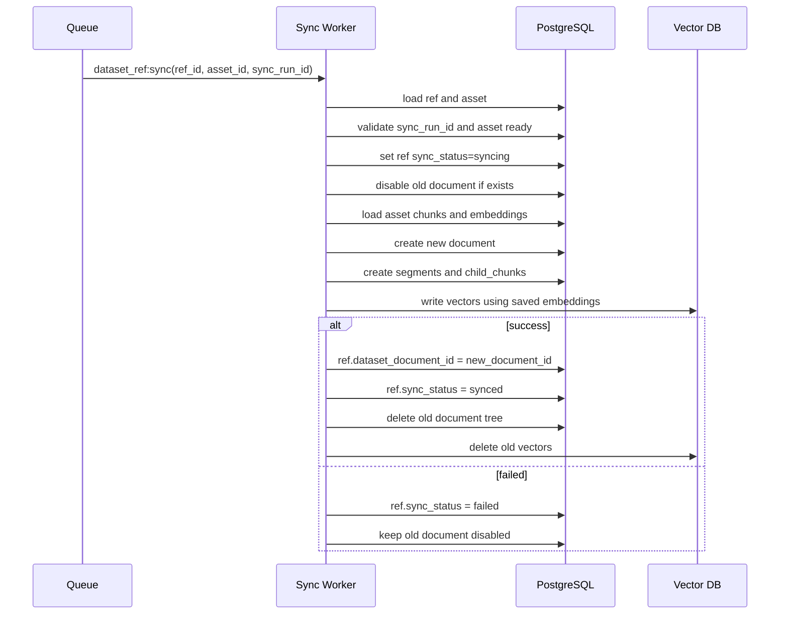
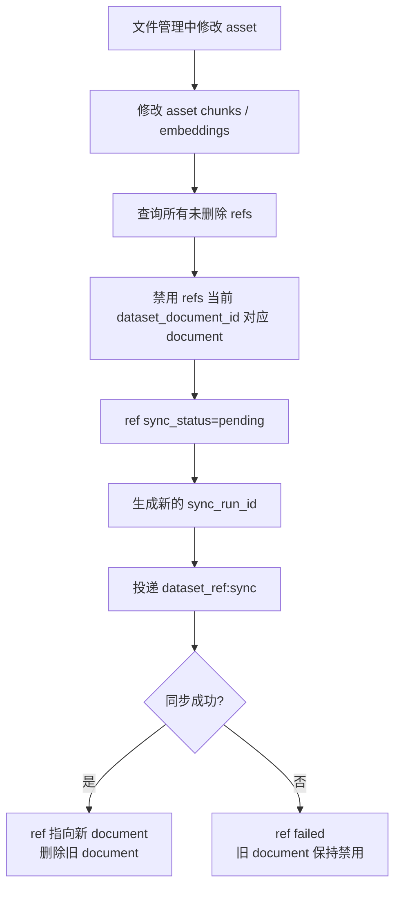
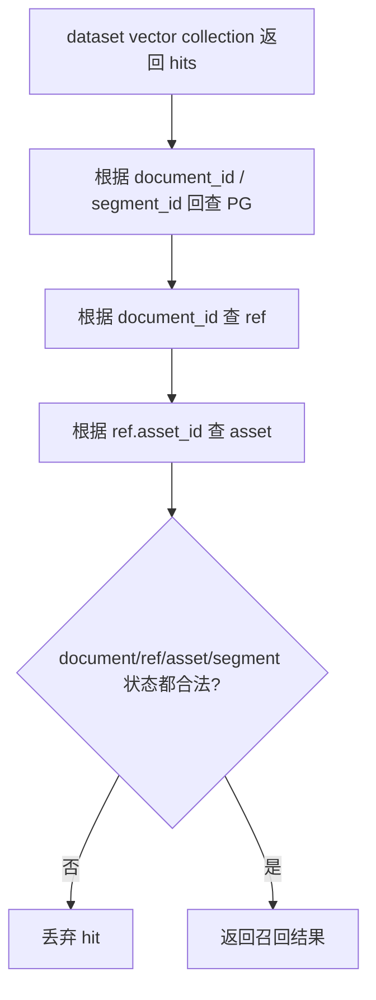

# 文件管理与知识库 V1 阶段二实施方案

> 状态：Draft  
> 日期：2026-06-02  
> 依据：`docs/file-knowledge-v1-technical-design.md`、阶段一已完成的文件资产处理链路，以及阶段二产品形态讨论结论。

## 1. 方案结论

阶段二采用“文件资产复制到知识库 document”的形态。

核心结论：

- 文件管理层持有唯一资产事实：源文件、解析内容、一级/二级切片、chunk embedding。
- 知识库不再作为源文件创建入口。以后知识库中的 document 只来自文件资产同步。
- 用户在知识库中添加文档时，不重新解析、不重新切片、不重新 embedding；系统直接读取文件资产当前 chunks 和 embeddings，复制生成知识库 `documents/document_segments/child_chunks`，并写入当前知识库自己的向量 collection。
- 每个知识库仍使用自己的向量 collection，不使用全局大向量库后过滤的方案。
- ref 表只负责维护“asset 同步到了哪个 dataset 的哪个 document”，不控制 document 启用停用。
- document 启停仍由原 `documents.enabled` 维护。
- asset 修改后，通过 ref 表找到所有关联知识库 document，先禁用旧 document，再重建新 document。成功后 ref 指向新 document，并立即删除旧 document 及其 segments、child chunks、向量。失败时 ref 进入 failed，仍指向旧 document，但旧 document 保持禁用，不参与召回。

## 2. 产品形态

### 2.1 文件管理

文件管理是内容资产工作台。

用户可以在文件管理中：

- 上传文件。
- 解析文件。
- 人工确认解析结果。
- 查看一级/二级切片。
- 编辑二级切片。
- 启用或停用二级切片。
- 重新解析文件。
- 使用文件级问答。

这些操作修改的是文件资产层数据。

### 2.2 知识库

知识库是文件资产的召回集合。

用户可以在知识库中：

- 添加已就绪文件资产。
- 查看文件同步状态。
- 查看知识库 document 是否启用。
- 启用或停用 document。
- 移除 document。
- 对同步失败的 document 发起重新同步。
- 跳转到文件管理查看或编辑源文件资产。

用户不可以在知识库中：

- 上传源文件并触发解析。
- 直接编辑切片。
- 直接新增、删除、重排切片。
- 生成只属于某个知识库的私有切片版本。

如果用户对知识库中的切片不满意，需要跳转到文件管理修改源 asset。修改完成后，系统自动同步所有引用该 asset 的知识库 document。

## 3. 核心数据关系



语义：

- `data_library_document_assets` 是文件资产。
- `data_library_document_chunks` 是文件资产当前切片。
- `data_library_document_chunk_embeddings` 是文件资产当前二级切片向量。
- `documents` 是知识库中的 document 副本。
- `document_segments/child_chunks` 是知识库 document 下的召回切片副本。
- `data_library_knowledge_base_asset_refs` 是 asset 到 dataset document 的同步关系。

## 4. ref 表职责

ref 表的职责只保留同步关系。

它负责：

1. 找到某个 asset 被哪些知识库同步过。
2. 找到某个 asset 在某个 dataset 中对应哪个 `documents.id`。
3. 记录同步状态。
4. 支持 asset 修改后的批量重投影。
5. 支持源文件删除保护。
6. 支持同步失败后的重试。
7. 防止旧同步任务晚完成后覆盖新状态。

它不负责：

- 不控制 document 启用停用。
- 不作为主要召回过滤条件来表达“当前知识库有哪些文档”。当前知识库有哪些文档由 `documents` 表和 dataset vector collection 自身表达。
- 不保存知识库私有切片内容。

## 5. ref 表字段

建议表名继续使用：

```text
data_library_knowledge_base_asset_refs
```

建议字段：

| 字段 | 类型 | 说明 |
| --- | --- | --- |
| `id` | uuid pk | ref id |
| `organization_id` | varchar(255) | 组织 |
| `workspace_id` | varchar(255) null | 工作空间 |
| `dataset_id` | uuid | 知识库 id |
| `asset_id` | uuid | 文件资产 id |
| `dataset_document_id` | uuid null | 当前同步成功或当前保留的知识库 document id |
| `sync_status` | varchar(32) | `pending/syncing/synced/failed` |
| `synced_generation_no` | bigint null | 当前 `dataset_document_id` 对应的 asset generation |
| `sync_run_id` | uuid null | 当前同步任务标识，用于防旧任务回写 |
| `last_synced_at` | timestamptz null | 最近同步成功时间 |
| `sync_error_code` | varchar(128) null | 同步失败错误码 |
| `sync_error_message` | text null | 同步失败原因 |
| `metadata_json` | jsonb | 扩展信息 |
| `created_by` | varchar(255) null | 创建人 |
| `created_at` | timestamptz | 创建时间 |
| `updated_at` | timestamptz | 更新时间 |
| `deleted_at` | timestamptz null | 移除引用时间 |

唯一约束：

```sql
CREATE UNIQUE INDEX IF NOT EXISTS idx_data_library_kb_asset_refs_dataset_asset_active
  ON public.data_library_knowledge_base_asset_refs (organization_id, dataset_id, asset_id)
  WHERE deleted_at IS NULL;
```

索引：

```sql
CREATE INDEX IF NOT EXISTS idx_data_library_kb_asset_refs_asset_active
  ON public.data_library_knowledge_base_asset_refs (organization_id, asset_id)
  WHERE deleted_at IS NULL;

CREATE INDEX IF NOT EXISTS idx_data_library_kb_asset_refs_dataset_status
  ON public.data_library_knowledge_base_asset_refs (organization_id, dataset_id, sync_status)
  WHERE deleted_at IS NULL;

CREATE INDEX IF NOT EXISTS idx_data_library_kb_asset_refs_document
  ON public.data_library_knowledge_base_asset_refs (dataset_document_id)
  WHERE dataset_document_id IS NOT NULL AND deleted_at IS NULL;

CREATE INDEX IF NOT EXISTS idx_data_library_kb_asset_refs_sync_run
  ON public.data_library_knowledge_base_asset_refs (sync_run_id)
  WHERE sync_run_id IS NOT NULL AND deleted_at IS NULL;
```

兼容迁移说明：

- 历史 `version_id` 不再参与阶段二主链路，可改为 nullable 或废弃。
- 历史 `status` 如果存在，不再作为 ref 的启停字段。同步状态统一使用 `sync_status`。
- 历史 `projection_document_id` 如果已存在，可迁移或重命名为 `dataset_document_id`。

## 6. data_source_type 处理

阶段二确定后，知识库 document 的来源只允许是文件资产同步，不允许知识库内部创建源文件 document。

因此新链路不再需要用 `documents.data_source_type` 区分来源。

实施口径：

- 新接口、新服务、新前端不再依赖 `data_source_type` 做业务判断。
- 新创建的知识库 document 不需要再表达 `upload_file/text_input/website/data_library_asset_ref` 等来源分支。
- 旧代码中依赖 `data_source_type` 的入口需要逐步收敛或移除。
- 数据库字段如果仍被大量旧代码引用，可以先从业务逻辑中废弃，再在清理迁移中删除字段；如果阶段二同步改造能一次性清理相关依赖，则直接 drop 该字段。

删除前必须确认以下旧能力已经不再使用：

- 知识库内部上传文件创建 document。
- 文本输入创建 document。
- 网站抓取创建 document。
- 基于 `data_source_type` 的 indexing runner 分支。

## 7. 同步状态机



状态语义：

| 状态 | 含义 | 是否参与召回 |
| --- | --- | --- |
| `pending` | 等待同步 | 否 |
| `syncing` | 正在同步 | 否 |
| `synced` | 同步成功 | 取决于 `documents.enabled` |
| `failed` | 同步失败 | 否 |

注意：

- ref 不保存 enabled。
- document 启停由 `documents.enabled` 控制。
- 如果 ref 不是 `synced`，即使旧 document 还存在，也必须保持禁用，不参与召回。

## 8. 添加文档到知识库

### 8.1 流程图



### 8.2 候选资产

接口：

```text
GET /datasets/:dataset_id/file-candidates
```

只返回文件管理中的资产。

可添加条件：

- asset 属于当前组织和 workspace。
- asset `product_status='ready'`。
- asset `vector_status='ready'`。
- asset 当前 `generation_no` 下有 enabled、ready 的二级 chunk。
- 每个 enabled 二级 chunk 有 ready embedding。
- asset embedding provider/model/dimension 与 dataset 当前 embedding 配置一致。
- 当前 dataset 没有未删除 ref 指向该 asset。

不可添加原因：

| reason | 含义 |
| --- | --- |
| `not_ready` | asset 未就绪 |
| `already_added` | 当前 dataset 已有未删除 ref |
| `embedding_model_mismatch` | embedding 配置不一致 |
| `missing_chunks` | 没有可同步 chunk |
| `missing_embedding` | 缺少 ready embedding |

### 8.3 添加接口

接口：

```text
POST /datasets/:dataset_id/file-refs
```

请求：

```json
{
  "asset_ids": ["..."]
}
```

处理规则：

1. 逐项校验 asset 是否可添加。
2. 创建 ref：
   - `dataset_id`
   - `asset_id`
   - `dataset_document_id=null`
   - `sync_status=pending`
   - `synced_generation_no=null`
   - `sync_run_id=new uuid`
3. 投递 `dataset_ref:sync`。
4. 返回逐项结果，允许部分失败。

重复添加：

- 同一 dataset 下同一 asset 只能存在一个未删除 ref。
- 如果已有 ref 且 `sync_status=failed`，前端应展示“重新同步”，而不是重复添加。

## 9. 文档同步 worker

任务类型：

```text
dataset_ref:sync
```

任务载荷：

```json
{
  "ref_id": "...",
  "asset_id": "...",
  "dataset_id": "...",
  "generation_no": 12,
  "sync_run_id": "..."
}
```

### 9.1 worker 总流程



### 9.2 worker 开始校验

worker 开始前必须校验：

- ref 存在且未软删。
- ref `sync_run_id` 等于任务载荷中的 `sync_run_id`。
- ref `sync_status` 是 `pending` 或 `syncing`。
- asset 存在且未删除。
- asset `product_status='ready'`。
- asset `vector_status='ready'`。
- 任务 generation 等于 asset 当前 `generation_no`。
- dataset 存在且属于当前组织和 workspace。

如果 `sync_run_id` 不一致，说明已经有更新的同步任务，当前任务直接退出，不改 ref 状态。

### 9.3 禁用旧 document

如果 ref 当前已有 `dataset_document_id`：

1. 读取旧 document。
2. 立即设置旧 document：
   - `enabled=false`
   - `disabled_at=now`
3. 确保旧 document 不再参与召回。
4. 旧 document 暂不立刻删除，等待新 document 成功后再清理。

这样可以保证 asset 被修改后，旧知识库 document 不会继续被召回。

### 9.4 创建新 document

同步服务根据 asset 当前结果创建一个新的 `documents` 记录。

建议字段：

| 字段 | 值 |
| --- | --- |
| `dataset_id` | 当前知识库 |
| `file_id` | asset 对应的源文件 id |
| `name` | 源文件名 |
| `enabled` | 默认 true |
| `indexing_status` | 创建中为 `indexing`，完成后为 `completed` |
| `doc_metadata` | asset/ref/generation/source_file 等来源信息 |

`doc_metadata` 建议保留来源信息，虽然不再依赖 `data_source_type`：

```json
{
  "source_file_id": "upload_file_id",
  "asset_id": "asset_id",
  "ref_id": "ref_id",
  "generation_no": 12,
  "embedding_provider": "provider",
  "embedding_model": "model",
  "embedding_dimension": 1536
}
```

### 9.5 创建 segments 和 child chunks

层级切片：

- asset `parent` chunk 复制为 `document_segments`。
- asset `child/auto/manual` chunk 复制为 `child_chunks`。
- `child_chunks.segment_id` 指向对应 parent segment。

非层级切片：

- asset `auto/manual` chunk 直接复制为 `document_segments`。

建议给知识库切片副本记录来源信息：

- `source_asset_id`
- `source_chunk_id`
- `source_generation_no`
- `source_content_hash`

如果暂时不加新字段，可以先写入 `doc_metadata` 或 segment metadata，但不建议长期塞在 `keywords` 里。

### 9.6 写入向量

写入当前 dataset 的 vector collection。

必须使用：

```text
data_library_document_chunk_embeddings.embedding_vector
```

禁止：

- 不调用 embedding 模型。
- 不重新基于 document segment 文本生成向量。
- 不改变 asset 层 chunk 和 embedding。

向量 metadata 至少包含：

```json
{
  "dataset_id": "dataset id",
  "document_id": "new document id",
  "segment_id": "segment id",
  "child_chunk_id": "child chunk id if any",
  "asset_id": "asset id",
  "ref_id": "ref id",
  "source_file_id": "upload file id",
  "source_chunk_id": "asset chunk id",
  "generation_no": 12,
  "content_hash": "chunk content hash"
}
```

### 9.7 成功提交

新 document、segments、child chunks、vectors 全部成功后：

1. 再次校验 ref 当前 `sync_run_id` 仍等于任务载荷。
2. 更新 ref：
   - `dataset_document_id = new_document_id`
   - `sync_status = synced`
   - `synced_generation_no = asset.generation_no`
   - `last_synced_at = now`
   - `sync_error_code = null`
   - `sync_error_message = null`
3. 立即清理旧 document：
   - 删除旧 `child_chunks`
   - 删除旧 `document_segments`
   - 删除旧 `documents`
   - 删除旧 document 对应的向量节点

成功后必须马上清理旧 document 及其所有下游产物，避免旧数据干扰召回和管理页面。

### 9.8 失败处理

如果任意步骤失败：

1. ref 更新为：
   - `sync_status=failed`
   - `sync_error_code`
   - `sync_error_message`
2. ref 的 `dataset_document_id` 保持不变，仍指向旧 document。
3. 旧 document 保持 `enabled=false`，不参与召回。
4. 如果新 document 已部分创建，必须尽力清理新 document、segments、child chunks、vectors。
5. 前端在知识库文件页展示该 document 同步失败，并提供“重新同步”按钮。

## 10. asset 修改后的同步

asset 修改包括：

- 重新解析。
- 编辑二级切片。
- 启用或停用二级切片。
- 手工新增或删除二级切片，如果后续支持。
- 任何会影响 asset 当前 chunks 或 embeddings 的操作。

### 10.1 触发流程



### 10.2 重新解析

重新解析会递增 `asset.generation_no`。

流程：

1. 用户发起重新解析。
2. asset 进入 `parsing`，`generation_no + 1`。
3. 查询所有未删除 ref。
4. 禁用每个 ref 当前 `dataset_document_id` 对应 document。
5. ref 标记为 `pending`，生成新的 `sync_run_id`。
6. 解析、确认、切片、embedding 全部成功后，asset 回到 `ready`。
7. 为所有 ref 投递 `dataset_ref:sync`。
8. 同步成功后 ref 指向新 document。
9. 同步失败则 ref failed，旧 document 仍禁用。

解析失败时：

- asset 进入 `parse_failed`。
- ref 保持 `pending` 或更新为 `failed`，错误码可为 `asset_parse_failed`。
- 旧 document 继续禁用，不参与召回。

### 10.3 编辑二级切片

编辑二级切片通常不递增 `generation_no`。

流程：

1. 更新 asset chunk 内容和 `content_hash`。
2. 只重算该 chunk 的 embedding。
3. 查询所有未删除 ref。
4. 禁用每个 ref 当前 document。
5. ref 标记为 `pending`，生成新的 `sync_run_id`。
6. 投递 `dataset_ref:sync`。

虽然 `generation_no` 不变，但 `sync_run_id` 会变化，可以防止同 generation 下旧同步任务回写。

当前实现约束：

- 文件资产二级切片 PATCH 成功后，会先更新 asset chunk 和对应 embedding。
- 更新成功后，后端立即查询所有未删除知识库 ref。
- 对每条 ref 禁用当前 `dataset_document_id` 对应 document。
- ref 标记为 `pending`，生成新的 `sync_run_id`。
- 使用当前 `asset.generation_no` 投递 `dataset_ref:sync`，worker 会复制最新的当前 generation chunks/embeddings。
- 如果投递同步任务失败，本次 PATCH 返回失败，避免 ref 长时间停留在无任务执行的 pending 状态。

### 10.4 启停二级切片

启停二级切片不需要重新 embedding。

流程：

1. 更新 asset chunk `enabled`。
2. 查询所有未删除 ref。
3. 禁用当前 document。
4. ref 标记为 `pending`，生成新的 `sync_run_id`。
5. 重建知识库 document。

## 11. 重新同步

前端在 ref `sync_status=failed` 时展示“重新同步”按钮。

接口：

```text
POST /datasets/:dataset_id/file-refs/:ref_id/sync/retry
```

处理规则：

1. ref 必须存在且未删除。
2. asset 必须存在。
3. asset 必须是 `ready` 且 `vector_status=ready`。
4. 禁用当前 `dataset_document_id` 对应 document。
5. ref 更新：
   - `sync_status=pending`
   - `sync_run_id=new uuid`
   - `sync_error_code=null`
   - `sync_error_message=null`
6. 投递 `dataset_ref:sync`。

重新同步成功后，ref 指向新 document，并立即删除旧 document。

重新同步失败后，ref 仍指向旧 document，旧 document 保持禁用。

## 12. document 启停

document 启停继续使用原 `documents.enabled`。

接口可沿用原有知识库 document 启停接口，或在 file refs 页面封装为：

```text
PATCH /datasets/:dataset_id/file-refs/:ref_id/document
```

请求：

```json
{
  "enabled": false
}
```

处理规则：

- 根据 ref 找到 `dataset_document_id`。
- 更新 `documents.enabled`。
- 不修改 ref `sync_status`。
- 不触发 asset 同步。

如果 ref 不是 `synced`，前端不应允许用户通过启用 document 让它参与召回。服务端召回保护也必须检查 ref 状态。

## 13. 移除知识库 document

用户从知识库移除一个文件资产 document。

流程：

1. 找到 ref。
2. 软删除 ref：写入 `deleted_at`。
3. 删除 `dataset_document_id` 对应 document 及其下游产物：
   - vectors
   - child chunks
   - document segments
   - document
4. 不删除源文件。
5. 不删除 asset。
6. 不删除 asset chunks 和 embeddings。

移除后，文件管理中的源文件仍可继续被其他知识库引用。

## 14. 源文件删除保护

删除源文件或 asset 时，必须检查 ref 表。

规则：

- 只要存在未软删 ref，就阻止删除源文件。
- 即使 ref `sync_status=failed`，也要阻止删除，因为该知识库仍然声明要使用这个 asset。
- 用户必须先到对应知识库移除引用，再删除源文件。

删除保护返回信息：

```json
{
  "reason": "referenced_by_knowledge_base",
  "datasets": [
    {
      "id": "dataset_id",
      "name": "dataset name",
      "sync_status": "failed"
    }
  ]
}
```

## 15. 召回保护

每个知识库有自己的 vector collection，因此召回不需要用 ref 表过滤“不属于当前知识库”的资产。

但为了防止同步失败、同步中、旧 document 残留造成误召回，召回转换阶段仍需做保护。

允许召回的条件：

| 层级 | 条件 |
| --- | --- |
| document | 属于当前 dataset |
| document | `enabled=true` |
| document | `indexing_status='completed'` |
| document | 未 archived / 未 deleted |
| ref | 存在且未软删 |
| ref | `dataset_document_id = document.id` |
| ref | `sync_status='synced'` |
| asset | 存在且未删除 |
| asset | `product_status='ready'` |
| asset | `vector_status='ready'` |
| ref/asset | `ref.synced_generation_no = asset.generation_no` |
| segment/child chunk | enabled 且未删除 |

召回保护流程：



命中结果建议返回：

```json
{
  "dataset_id": "...",
  "document_id": "...",
  "asset_id": "...",
  "ref_id": "...",
  "source_file_id": "...",
  "source_chunk_id": "...",
  "generation_no": 12,
  "score": 0.88
}
```

## 16. 接口清单

### 16.1 候选文件

```text
GET /datasets/:dataset_id/file-candidates
```

返回可添加资产及不可添加原因。

### 16.2 知识库文件列表

```text
GET /datasets/:dataset_id/file-refs
```

返回 ref、asset、当前 document、同步状态、错误信息。

### 16.3 添加文件

```text
POST /datasets/:dataset_id/file-refs
```

创建 ref 并投递同步任务。

### 16.4 重新同步

```text
POST /datasets/:dataset_id/file-refs/:ref_id/sync/retry
```

失败或用户手动触发时重新同步。

### 16.5 移除引用

```text
DELETE /datasets/:dataset_id/file-refs/:ref_id
```

软删 ref，删除知识库 document 副本和向量，不删除 asset。

### 16.6 启停 document

可沿用原 document 启停接口，也可通过 file refs 页面代理到 document 启停。

ref 本身不提供 enabled 字段。

## 17. 后端任务拆分

| 编号 | 任务 | 验收 |
| --- | --- | --- |
| P2-BE-01 | ref 表迁移 | 增加 `dataset_document_id/sync_status/synced_generation_no/sync_run_id/sync_error/last_synced_at/deleted_at`，废弃 version/status 主链路 |
| P2-BE-02 | ref repository/service | 支持按 dataset、asset、document 查询，标记 pending/syncing/synced/failed，软删除 |
| P2-BE-03 | file-candidates API | 返回符合条件的 ready assets 和不可添加原因 |
| P2-BE-04 | file-refs API | 添加、列表、移除、重试 |
| P2-BE-05 | dataset_ref:sync worker | 根据 asset chunks/embeddings 新建 document、segments、child chunks、vectors |
| P2-BE-06 | 旧 document 禁用和成功清理 | 同步开始禁用旧 document，成功后立即删除旧 document tree 和 vectors |
| P2-BE-07 | asset 修改触发同步 | 重新解析、chunk 编辑、chunk 启停后批量标记 refs pending 并入队 |
| P2-BE-08 | 召回保护 | 召回结果必须校验 document/ref/asset 状态 |
| P2-BE-09 | 删除保护 | 源文件删除检查未软删 refs |
| P2-BE-10 | 后端测试 | 幂等、失败、旧任务回写、重试、清理、删除保护 |

## 18. 前端任务拆分

| 编号 | 任务 | 验收 |
| --- | --- | --- |
| P2-FE-01 | 知识库文件页数据源切换 | 从 file-refs 获取数据 |
| P2-FE-02 | 添加文件弹窗 | 使用 file-candidates，只允许选择 addable assets |
| P2-FE-03 | 同步状态展示 | 展示 pending/syncing/synced/failed 和错误原因 |
| P2-FE-04 | 重新同步按钮 | failed 状态可触发 retry |
| P2-FE-05 | 查看源文件 | 跳转文件管理详情页 |
| P2-FE-06 | document 启停 | 控制 `documents.enabled` |
| P2-FE-07 | 移除引用 | 删除 ref 和知识库 document 副本，不删除源文件 |
| P2-FE-08 | 召回结果来源 | 展示 asset/document/chunk 来源并可跳转 |

## 19. 验收场景

| 编号 | 场景 | 预期 |
| --- | --- | --- |
| P2-QA-01 | ready asset 出现在添加候选 | 可选择添加 |
| P2-QA-02 | embedding 模型不一致 | 不可添加，显示原因 |
| P2-QA-03 | 添加 asset 到知识库 | 创建 ref，生成新 document，sync_status=synced |
| P2-QA-04 | 同步成功后召回 | 可命中新 document 的切片 |
| P2-QA-05 | 禁用 document | 不再召回该 document |
| P2-QA-06 | 重新启用 document | ref synced 时恢复召回 |
| P2-QA-07 | 编辑 asset 二级切片 | 旧 document 立即禁用，新 document 同步成功后替换 |
| P2-QA-08 | asset 重新解析成功 | ref 指向新 document，旧 document 和向量被清理 |
| P2-QA-09 | asset 重新解析失败 | ref failed，旧 document 禁用，不参与召回 |
| P2-QA-10 | 同步失败后重试 | 重新创建新 document，成功后 ref synced |
| P2-QA-11 | 旧同步任务晚完成 | 因 sync_run_id 不一致不能覆盖新状态 |
| P2-QA-12 | 移除引用 | 删除知识库 document 副本，不删除 asset |
| P2-QA-13 | 删除源文件但仍有 ref | 删除被阻止，返回引用知识库列表 |

### 19.1 Chrome 回归记录

2026-06-02 在 Chrome 中测试 `codex_test` 知识库和 `语文课程介绍.docx` 文件资产：

- 迁移补跑后，如果 API 服务仍保持旧连接，可能出现 PostgreSQL `cached plan must not change result type`。本地验证需要在迁移后重启 API。
- 知识库文档页可正常展示 file refs，两条 ref 均为 `synced`。
- 文件资产详情页编辑二级切片成功后，页面显示新内容。
- 修复前，二级切片编辑只更新 asset chunk/embedding，没有触发 ref pending 和 `dataset_ref:sync` 入队，知识库 document 不会重建。
- 修复后，服务层测试覆盖：二级切片编辑成功后禁用旧 document、ref 进入 pending、生成新 `sync_run_id`，并以当前 `generation_no` 入队。

## 20. 关键风险与处理

### 20.1 旧 document 残留干扰召回

处理：

- 同步开始立即禁用旧 document。
- 新 document 成功后立即删除旧 document tree 和向量。
- 召回阶段额外校验 ref `dataset_document_id = document.id`。

### 20.2 同 generation 下旧同步任务回写

局部编辑 chunk 不递增 `generation_no`，所以必须使用 `sync_run_id`。

处理：

- 每次触发同步都生成新的 `sync_run_id`。
- worker 开始和成功提交前都校验 `sync_run_id`。

### 20.3 同步失败后没有可召回内容

这是预期行为。asset 已修改后，旧 document 不应继续召回。

处理：

- failed 状态下旧 document 保持禁用。
- 前端展示同步失败和重试入口。

### 20.4 向量清理失败

如果旧 document PG 删除成功但向量残留，可能污染召回。

处理：

- 成功替换时先记录旧 vector node ids。
- 清理向量失败时记录清理错误并重试 cleanup。
- 召回阶段通过 ref `dataset_document_id = document.id` 过滤，即使向量残留也不会返回有效结果。

### 20.5 data_source_type 清理影响旧功能

阶段二目标是知识库 document 只来自文件资产同步，但旧代码可能仍依赖 `data_source_type`。

处理：

- 先在新链路和新 UI 中移除 `data_source_type` 判断。
- 再清理旧知识库内部创建入口。
- 最后执行数据库字段删除或模型字段删除。
