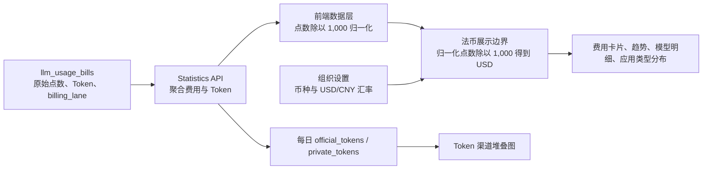

# 用量中心法币展示与 Token 渠道拆分设计

## 1. 文档状态

- 状态：已实现
- 验证环境：`dev2`
- 日期：2026-07-23
- 对应提交：
  - `2c369c2be feat: display usage costs in fiat currency`
  - `90d70ce26 feat: split token trends by billing channel`
  - `75fdf9141 fix: render stacked token bars directly`

## 2. 背景

用量页面原先直接展示内部点数。点数适合系统内部计费和结算，但用户无法直接判断实际消耗了多少法币，增加了理解成本。

同时，每日 Token 趋势只展示总量，无法回答 Token 是通过官方渠道还是私有渠道产生的。

本次设计解决两个问题：

1. 内部继续使用点数结算，对外的用量与费用页面统一展示法币。
2. 每日 Token 趋势在查看全部来源时，区分官方渠道和私有渠道。

## 3. 设计目标

### 3.1 目标

- 不修改内部点数计费和结算逻辑。
- 用量相关的用户可见页面不再展示“点数”“Points”或“Credits”。
- 根据组织配置展示 USD 或 CNY。
- 费用汇总、趋势、模型明细和应用类型分布使用同一套法币换算逻辑。
- 每日 Token 趋势能够同时展示官方渠道和私有渠道，并保持柱高等于总 Token。
- 保留来源筛选能力；筛选单一来源后只展示该来源的数据。

### 3.2 非目标

- 不修改 `llm_usage_bills` 的点数精度或结算规则。
- 不把数据库中的点数改存为法币。
- 不引入实时汇率服务。
- 不改造额度录入、渠道钱包等仍需使用内部点数的管理页面。
- 不把 Token 渠道拆分扩展到所有统计维度；本次只增加每日趋势需要的字段。

## 4. 核心原则

### 4.1 内部计费单位与外部展示单位分离

数据库中的点数是结算事实，不能因为展示需求改变。法币只是点数在展示边界上的换算结果。

### 4.2 只在一个边界完成法币换算

所有用量页面统一调用 `billing-display.ts`，页面组件不自行计算汇率，避免不同页面出现不同金额。

### 4.3 渠道归属使用结算事实

Token 渠道拆分以账单字段 `billing_lane` 为准：

- `platform`：官方渠道
- `private`：私有渠道

不根据模型名称、供应商或价格是否为零推断渠道。

### 4.4 接口只做必要的增量

现有每日趋势接口只增加 `official_tokens` 和 `private_tokens` 两个字段，不新增接口，不修改已有字段语义。

## 5. 点数与法币的单位关系

前端当前存在两个单位边界：

| 阶段 | 单位 | 换算 |
| --- | --- | --- |
| API 与数据库 | 后端原始点数 | 结算原始值 |
| 前端数据层 | 归一化点数 | `原始点数 / 1,000` |
| 法币展示层 | USD | `归一化点数 / 1,000` |
| CNY 展示层 | CNY | `USD × 组织配置汇率` |

因此：

```text
1 USD = 1,000 归一化点数
1 USD = 1,000,000 后端原始点数

USD = 后端原始点数 / 1,000,000
CNY = 后端原始点数 / 1,000,000 × usd_to_cny_rate
```

示例：

```text
API 原始点数：9,661,550
前端归一化：9,661.55
USD：9.66155
USD 展示：$9.66
CNY 展示（汇率 7）：≈¥67.63
```

也就是说，前端原有的 `/1000` 是点数归一化，不是完整的法币换算。法币展示层还需要再 `/1000` 得到 USD。

## 6. 整体数据流



## 7. 法币展示设计

### 7.1 配置来源

展示设置复用组织已有字段：

- `billing_display_currency`：`USD` 或 `CNY`
- `usd_to_cny_rate`：美元兑人民币汇率

配置解析规则：

- 币种不是 `CNY` 时按 `USD` 处理。
- 汇率不是有效正数时使用默认值 `7`。

### 7.2 格式化规则

统一入口：

```text
formatBillingDisplayAmountFromNormalizedCredits
```

展示规则：

| 场景 | 结果 |
| --- | --- |
| USD | `$9.66` |
| CNY | `≈¥67.63` |
| 无效或负数 | `-` |
| 大于 0 且小于 0.0001 | `<$0.0001` 或 `≈<¥0.0001` |
| 金额小于 1 | 最多 4 位小数 |
| 其他金额 | 2 位小数 |

CNY 使用 `≈`，明确表示它是根据组织配置汇率换算的展示金额，不改变真实计费仍按 USD 保存的事实。

### 7.3 覆盖页面

| 页面区域 | 改动 |
| --- | --- |
| 控制面板用量摘要 | 总点数改为总费用 |
| 用量总览卡片 | 官方、私有、总点数改为对应渠道费用和总费用 |
| 每日趋势 | 点数趋势改为费用趋势，纵轴、Tooltip 和总计均展示法币 |
| 模型用量明细 | 官方、私有、总点数列改为费用列 |
| 模型费用分布 | 数值、Tooltip、总计改为法币 |
| 应用类型分布 | 数值、Tooltip、中心总计改为法币 |
| 中英文文案 | 用量模块不再出现点数、Points 或 Credits |

内部字段名仍保留 `official_points`、`private_points` 和 `total_points`，避免把展示需求扩散到计费领域模型。

### 7.4 页面展示规则

调用数和 Token 保留原始统计单位；官方渠道、私有渠道和总消耗统一展示为组织配置的法币。组织使用人民币展示时，金额以 `≈¥` 为前缀，并按组织汇率从 USD 换算。

## 8. Token 渠道拆分设计

### 8.1 API 增量

每日趋势项增加两个字段：

```json
{
  "date": "2026-07-23",
  "total_tokens": 1000000,
  "official_tokens": 650000,
  "private_tokens": 350000
}
```

SQL 聚合规则：

```sql
SUM(CASE WHEN billing_lane = 'platform' THEN total_tokens ELSE 0 END)
SUM(CASE WHEN billing_lane = 'private' THEN total_tokens ELSE 0 END)
```

这两个字段只增加在 `daily_trend`，因为当前只有每日趋势需要按渠道拆分 Token。

### 8.2 图表行为

查看全部来源时：

- 官方渠道 Tokens：蓝色 `#3B82F6`
- 私有渠道 Tokens：橙色 `#F59E0B`
- 两个序列使用相同的 `stackId="tokens"`。
- 每日柱高表示当日总 Token。
- Tooltip 同时展示官方、私有、总 Token 和调用结果。
- 图例使用文字和颜色共同区分渠道。

筛选官方或私有来源时：

- API 使用现有来源筛选参数返回单一来源数据。
- 图表只展示一个总 Token 序列，不重复显示无意义的双渠道图例。

接口未返回渠道 Token 或渠道 Token 全为零时：

- 保持原有总 Token 单序列展示。
- 不把无数据误画成渠道拆分。

### 8.3 Recharts 渲染约束

两个堆叠 `Bar` 必须是 `BarChart` 的直接子节点，不能包在 React Fragment 中。

Recharts 不会把 Fragment 内的 `Bar` 识别为有效序列。首次实现中出现过“图例存在但柱体不显示”的问题，因此增加契约测试锁定这一约束。

## 9. 接口与数据兼容性

### 9.1 数据库

不需要数据库迁移。现有账单表已经包含：

- `billing_lane`
- `total_tokens`
- `official_points`
- `private_points`
- `total_points`

### 9.2 API

`official_tokens` 和 `private_tokens` 是新增字段，不修改已有字段，旧前端可以直接忽略。

### 9.3 前端

前端将缺失的新增字段归一化为 `0`。为了减少滚动发布期间的短暂不一致，部署顺序为：

1. 先部署 API。
2. 再部署 Web。

## 10. 方案取舍

### 10.1 不让后端直接返回组织展示币种金额

拒绝原因：

- 同一份账单可能被不同展示币种读取。
- 汇率是组织展示配置，不是账单结算事实。
- 后端返回法币会把展示逻辑耦合进统计接口。

最终选择：后端返回结算点数，前端统一在展示边界换算。

### 10.2 不修改点数存储模型

拒绝原因：

- 点数承担内部精度和结算职责。
- 改为法币会引入历史数据迁移与精度风险。
- 本需求只是降低用户认知成本，不需要修改计费事实。

### 10.3 不通过供应商推断 Token 渠道

拒绝原因：

- 同一供应商可能同时存在官方和私有渠道。
- 渠道是一次调用的结算属性，不是模型或供应商属性。

最终选择：使用每条账单的 `billing_lane` 聚合。

### 10.4 Token 使用堆叠柱而不是两根并列柱

堆叠柱同时表达：

- 每日总 Token 的规模。
- 官方和私有渠道的组成。

并列柱会弱化总量，额外增加横向空间和视觉比较成本。

## 11. 测试与验收

### 11.1 单元与契约测试

- `9,661.55` 归一化点数换算为 `$9.66`。
- 汇率为 `7` 时换算为 `≈¥67.63`。
- 极小非零费用不能显示为零。
- 无效费用显示 `-`。
- 用量模块中英文文案不允许出现点数、Points 或 Credits。
- 所有用量费用展示面必须使用统一法币格式化函数。
- 每日趋势 API 必须返回并映射 `official_tokens`、`private_tokens`。
- Token 图必须包含两个同栈序列。
- Recharts 堆叠 `Bar` 不允许包在 Fragment 中。

### 11.2 工程验证

- Go statistics 模块测试通过。
- 前端 TypeScript 类型检查通过。
- 相关文件 ESLint 通过。
- Web 生产构建通过。
- dev2 API 与 Web 健康检查通过。
- 浏览器验证蓝橙堆叠柱、图例和总 Token 正常展示。

## 12. 验收标准

- 用户在用量页面看不到内部点数单位。
- USD/CNY 金额与组织配置一致。
- 官方费用、私有费用和总费用使用同一换算规则。
- 全部来源下，每日 Token 能区分官方和私有渠道。
- 单一来源筛选下，图表只展示该来源的 Token。
- 官方 Token 与私有 Token 之和构成每日总 Token。
- 不新增数据库迁移，不改变内部结算结果。

## 13. 已知边界

- CNY 是按组织配置汇率计算的展示值，不是实时汇率。
- 本次“对外不显示点数”的范围是控制面板和用量统计展示面，不包含仍需录入内部点数的管理功能。
- Token 渠道拆分当前只进入每日趋势，不进入模型和应用类型的 Token 拆分。

## 14. 关键实现位置

- 法币换算：`web/src/utils/billing-display.ts`
- 点数归一化：`web/src/utils/ai-credits.ts`
- 用量页面编排：`web/src/app/dashboard/usage/overview/page.tsx`
- 费用卡片：`web/src/components/usage/stats-cards.tsx`
- 费用与 Token 趋势：`web/src/components/usage/token-trend-chart.tsx`
- 模型明细：`web/src/components/usage/model-details-section.tsx`
- 应用类型分布：`web/src/components/usage/app-type-distribution-section.tsx`
- 每日趋势 DTO：`api/internal/modules/llm/statistics/dto/model_usage_dto.go`
- 每日趋势聚合：`api/internal/modules/llm/statistics/repository/model_usage_repository.go`
- 后端聚合测试：`api/internal/modules/llm/statistics/repository/model_usage_repository_test.go`
- 前端契约测试：
  - `web/scripts/test-billing-display.mjs`
  - `web/scripts/test-usage-fiat-display.mjs`
