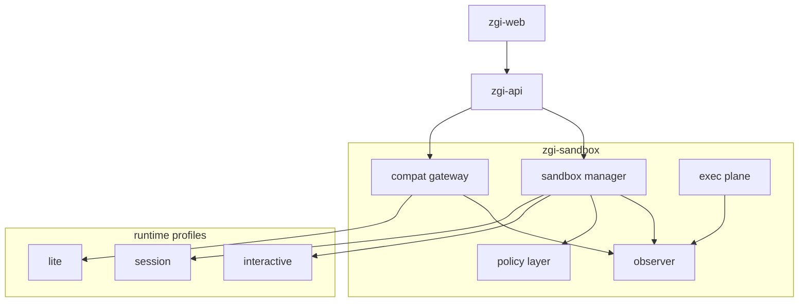

# zgi-sandbox Architecture

## 1. Design Conclusion

`zgi-sandbox` should be designed as an independent sandbox service, not as an internal module of `zgi-api`.

Why:

- `zgi-api` currently needs a compatible execution endpoint, but the sandbox will need to support far more runtime capabilities over time.
- Sandbox concerns such as isolation, resource scheduling, network policy, auditing, and lifecycle management are different from business API concerns.
- If the sandbox is embedded inside `zgi-api`, it will be harder to evolve into a session-based and interactive runtime platform later.

That means `zgi-sandbox` should play three roles:

- Provide a compatible interface to `zgi-api`
- Provide a shared execution foundation for future agent runtimes
- Provide an independent scaling and security boundary at the deployment layer

## 1.1 Should `zgo` Be the Base?

Yes, but only as a slim infrastructure shell. `zgi-sandbox` should not inherit `zgo`'s current default business modules.

Recommended reuse:

- Gin HTTP bootstrap structure
- Wire-based dependency injection layout
- Route wrapper conventions
- Shared package and test directory layout

Recommended removal:

- Default `deployment` and `platform` modules
- Existing code generators
- Startup assumptions that require a database by default

See [zgo-scaffold-review.md](./zgo-scaffold-review.md) for the detailed review.

## 2. Reference Patterns

### 2.1 Lightweight Execution Pattern

Key ideas to absorb:

- A small and fast `/v1/sandbox/run`
- Process-based execution
- `chroot + seccomp + setuid + UID pool`
- Request limits, worker limits, and timeouts
- A narrow language scope at the start: Python and Node.js

Why it matters:

- ZGI already has a remote execution path for workflow `code` nodes
- It allows `CODE_EXECUTION_ENDPOINT` replacement with minimal upstream change

What should not become the default:

- Dynamic dependency installation exposed by default
- A single `run` API with no lifecycle, files, commands, or endpoints
- One runtime shape forced onto every future agent use case

### 2.2 Managed Sandbox Platform Pattern

Key ideas to absorb:

- Separation between lifecycle control and execution control
- Sandboxes as first-class resources
- Unified execution surfaces for code, commands, files, and metrics
- TTL, renewal, and endpoint routing
- Egress policy
- Secure runtime and Kubernetes-based execution paths

Why it matters:

- The long-term direction for ZGI is not only "run code" but "run agent runtimes"

What should not be copied into V1:

- The full platform interface surface
- Complex pooled runtimes or Kubernetes controllers from day one
- Large multi-language SDKs before the service itself is stable

## 3. Target Shape for ZGI

ZGI should adopt a layered unified sandbox architecture:



## 4. Runtime Profiles

### 4.1 `lite`

Positioning:

- Compatible runtime for the current ZGI `code` node

Characteristics:

- No lifecycle resource exposed to upper layers
- One request, one execution
- Minimal API surface

Recommended implementation:

- Go HTTP service
- Python and Node.js runners
- Local isolated execution

Best for:

- Workflow code
- Short-lived transformations
- Simple template logic

### 4.2 `session`

Positioning:

- Reusable sandbox at the workflow-run level

Characteristics:

- Bound to `workflow_run_id`
- Supports filesystems, commands, and repeated code execution
- Longer-lived than a single request, but still short-lived infrastructure

Recommended implementation:

- Container-based runtime
- Allocation and cleanup through `sandbox manager`
- Code, command, and file APIs exposed through the `exec plane`

Best for:

- Multi-step tool chains
- LLM plus command plus file workflows
- Artifact generation flows

### 4.3 `interactive`

Positioning:

- Runtime for agent workspaces and browser-facing execution

Characteristics:

- Exposes ports
- Supports endpoint discovery
- Supports TTL renewal
- Requires stronger isolation

Recommended implementation:

- Container or microVM runtime
- Egress allowlist
- Optional secure runtime class

Best for:

- Coding agents
- Browser agents
- Web preview, IDE, and notebook scenarios

## 5. Control Plane and Execution Plane

### 5.1 Control Plane

The control plane should own:

- Sandbox create, get, and delete
- Runtime profile assignment
- Expiration renewal
- Endpoint resolution
- Metadata attachment
- Quota, audit, and trace records

This responsibility should live in `sandbox manager`.

### 5.2 Execution Plane

The execution plane should own:

- Code execution
- Command execution
- File operations
- Log and metrics streaming

This responsibility should live in `exec plane` or in a sandbox-local daemon.

### 5.3 Why the Separation Matters

- V1 only needs the execution plane
- V2 and V3 introduce lifecycle control gradually
- The split lets `lite` serve the compat API directly while `session` and `interactive` reuse the same lifecycle logic

## 6. API Design Guidance

### 6.1 V1 Compatible API

The V1 request should preserve the current ZGI payload:

```json
{
  "language": "python3",
  "code": "print('hello')",
  "preload": "",
  "enable_network": false
}
```

The response should stay compatible as well:

```json
{
  "code": 0,
  "message": "success",
  "data": {
    "stdout": "hello\n",
    "error": ""
  }
}
```

This layer should avoid breaking changes.

### 6.2 V2 Lifecycle APIs

Recommended endpoints:

- `POST /v1/sandboxes`
- `GET /v1/sandboxes/{id}`
- `DELETE /v1/sandboxes/{id}`
- `POST /v1/sandboxes/{id}/renew-expiration`
- `GET /v1/sandboxes/{id}/endpoints/{port}`

Requests should include:

- `runtime_profile`
- `timeout`
- `resource_limits`
- `metadata`
- `network_policy`
- `workspace_binding`

### 6.3 V2 Execution APIs

Recommended endpoints:

- `POST /v1/exec/code`
- `POST /v1/exec/command`
- `POST /v1/files/upload`
- `GET /v1/files/download`
- `GET /v1/files/info`
- `DELETE /v1/files`

## 7. Security Design

### 7.1 Default Policies

- Deny outbound networking by default
- Run as non-root by default
- Use short TTL by default
- Use ephemeral filesystems by default
- Allow only approved runtime images and dependency profiles by default

### 7.2 Why V1 Should Not Expose Dynamic Dependencies

Reasons:

- It increases supply-chain risk
- It makes cold starts slower
- It makes runtime behavior harder to reproduce and debug
- It makes resource costs harder to predict

V1 should prefer:

- Prebuilt Python profiles
- Prebuilt Node.js profiles
- Admin-managed dependency profiles

### 7.3 Runtime Isolation Levels

The service should distinguish these levels explicitly:

- `lite`: process isolation
- `session`: container isolation
- `interactive`: secure container or microVM isolation

Different use cases should not be forced into one isolation model.

## 8. Integration with ZGI Workflows

### 8.1 Code Node

Phase 1 takeover:

- Reuse the current remote call path in `zgi-api`
- Avoid workflow structure changes at the start

Phase 2 expansion:

- Add `runtime_profile`
- Add `dependency_profile`
- Add session binding

### 8.2 Tool Nodes

The following tool capabilities should move into the sandbox boundary:

- Shell commands
- File tools
- Code interpreter tools

Why:

- These capabilities touch host risk quickly
- Running them in the host process gives a weak security boundary

### 8.3 Workflow Executor

The executor will need to grow these capabilities:

- Allocate a session sandbox at run start
- Stop the sandbox when a run is canceled
- Clean up or archive the sandbox when a run finishes
- Correlate workflow logs with `sandbox_id`

## 9. Deployment Guidance

### 9.1 Single Host and Docker

Recommended for V1:

- Single service deployment
- Local isolated execution
- Docker Compose example
- Minimal external dependencies

This is the most practical match for ZGI's current self-hosted path.

### 9.2 Kubernetes and Secure Runtime

Recommended for V2 and V3:

- Move `session` and `interactive` runtimes to Kubernetes
- Add pooled or warm sandboxes if needed
- Add a secure runtime class if stronger isolation becomes necessary

## 10. Recommended Implementation Order

1. Build `lite` first.  
   Make `/v1/sandbox/run` work and replace the current execution path.

2. Build the session manager next.  
   Add create, get, delete, files, commands, and artifacts.

3. Build the interactive runtime last.  
   Add endpoints, renewal, egress, and secure runtime options.

## 11. Final Recommendation

From a long-term ZGI perspective, the right design is neither:

- A permanently minimal code runner
- Nor a fully expanded platform from day one

Instead, the right shape is:

- V1 solves execution compatibility first
- V2 and V3 evolve into a complete sandbox platform
- The service boundary remains an independent ZGI sandbox service throughout

That path fits both the current codebase and the long-term agent direction.
